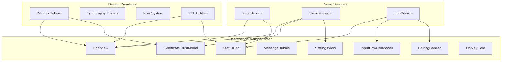
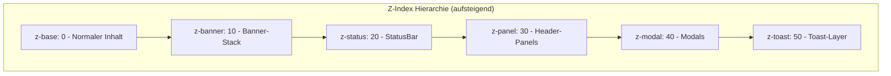
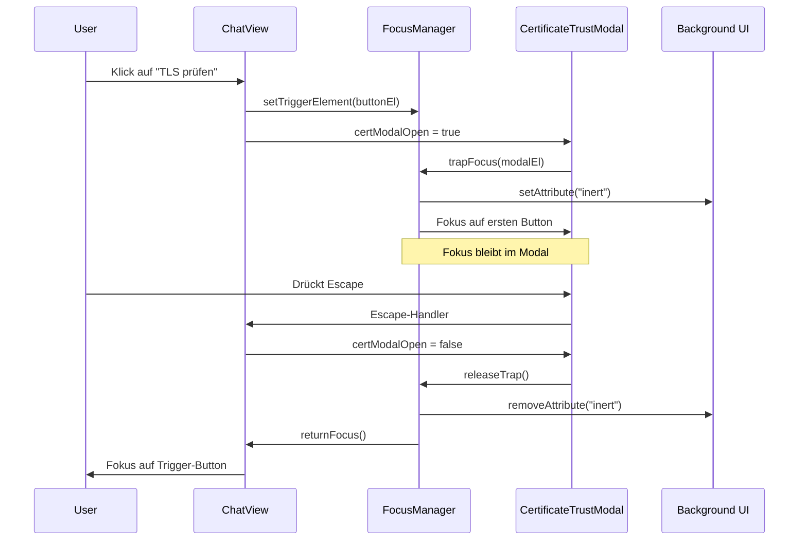
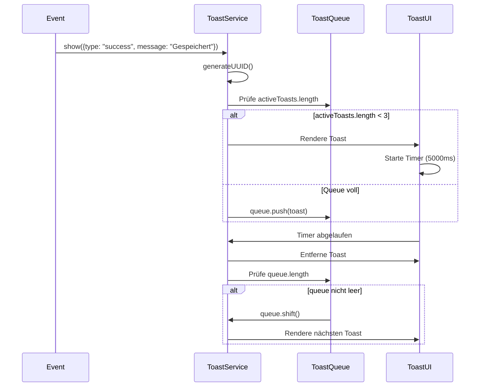
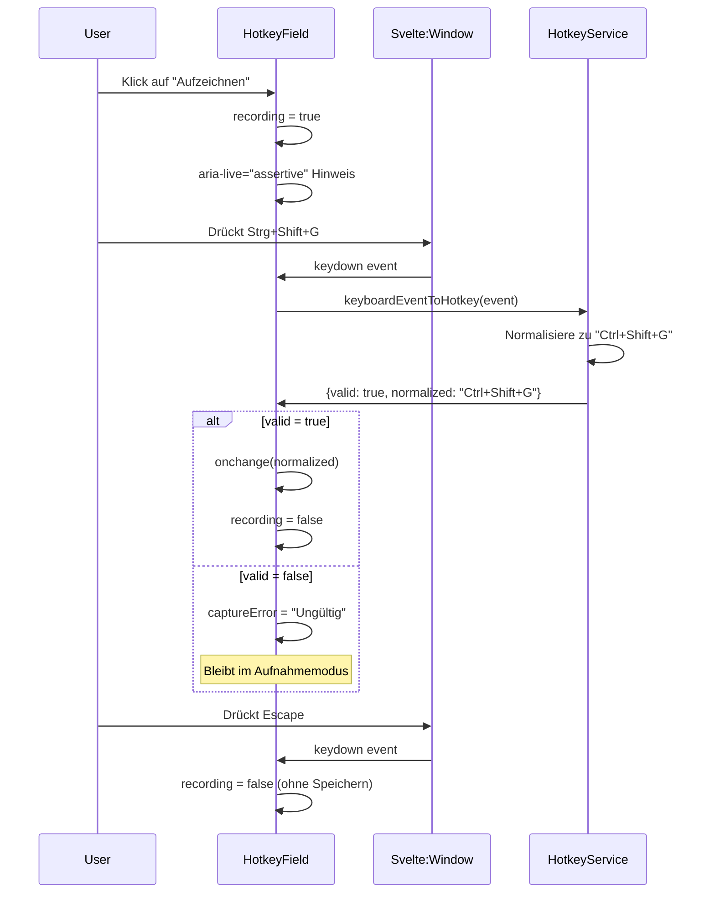

# Design Document: UI/UX-Improvements

## Overview

Dieses Design-Dokument beschreibt die technische Architektur und Umsetzung der UI/UX-Verbesserungen für agodesk, eine Tauri-2-/Svelte-5-Desktop-Anwendung. Ziel ist die Konsolidierung der visuellen Konsistenz, die vollständige WCAG-2.1-AA-Barrierefreiheit, die Internationalisierung (inkl. RTL), die Verbesserung der Tastaturnavigation und die Einführung neuer Services für globale UI-Zustände.

Das Dokument definiert neue Design-Token, Service-Architekturen, Komponenten-Modifikationen und Property-Based-Testing-Strategien zur Sicherstellung der Round-Trip-Invarianten.

## Architecture

### Übersicht der neuen Services und Primitives



### Schichten-Modell für Z-Index



## Components and Interfaces

### Komponente 1: ToastService

**Zweck**: Globaler Dienst zur Anzeige kurzzeitiger Hinweise (Erfolg/Warnung/Fehler) außerhalb des Chat-Verlaufs.

**Schnittstelle**:

```typescript
interface ToastOptions {
  type: "info" | "success" | "warning" | "error";
  message: string;
  duration?: number; // Standard: 5000ms für info/success, manuell für error
  dismissible?: boolean;
}

interface ToastItem extends ToastOptions {
  id: string;
  createdAt: number;
}

interface ToastService {
  show(options: ToastOptions): string; // Returns toast ID
  dismiss(id: string): void;
  dismissAll(): void;
  subscribe(run: (toasts: ToastItem[]) => void): () => void;
}
```

**Verantwortlichkeiten**:

- Verwaltung einer FIFO-Warteschlange mit maximal 3 gleichzeitig sichtbaren Toasts
- Automatisches Ausblenden nach konfigurierbarer Dauer
- Renderin in `role="alert"` für Fehler, `role="status"` für Info/Success
- Positionierung rechts unten mit animiertem Ein-/Ausblenden

### Komponente 2: FocusManager

**Zweck**: Zentralisierte Verwaltung des Fokus für Modals, Panels und Tastaturnavigation.

**Schnittstelle**:

```typescript
interface FocusManager {
  // Modal-Unterstützung
  trapFocus(container: HTMLElement): () => void;
  releaseTrap(): void;
  
  // Fokus-Rückgabe
  setTriggerElement(element: HTMLElement | null): void;
  returnFocus(): void;
  
  // Roving Tabindex für Menüs
  createRovingTabindex(container: HTMLElement, options?: {
    orientation?: "horizontal" | "vertical";
    loop?: boolean;
  }): () => void;
  
  // Modal-Status
  isInModal(): boolean;
  registerModal(modalId: string): void;
  unregisterModal(modalId: string): void;
}
```

**Verantwortlichkeiten**:

- Implementierung der Fokusfalle mit `Tab`/`Shift+Tab`-Zirkulation
- Speicherung des Trigger-Elements für Fokus-Rückgabe
- Unterstützung für `aria-modal` und `inert`-Attribut auf Hintergrund
- Roving-Tabindex-Implementierung für Overflow-Menü und Header-Panels

### Komponente 3: IconService

**Zweck**: Zentrale Verwaltung aller Icons mit einheitlicher Strichstärke und Größe.

**Schnittstelle**:

```typescript
interface IconDefinition {
  svg: string; // SVG-Markup ohne outer <svg>-Tag
  strokeWidth: number; // Standard: 2.0
  size: number; // Standard: 16 (16x16 viewport)
}

interface IconService {
  register(name: string, definition: IconDefinition): void;
  get(name: string): IconDefinition | undefined;
  render(name: string, options?: { size?: number; class?: string }): string;
}

// Icon-Set Definition
const ICON_SET: Record<string, IconDefinition> = {
  // Navigation & Actions
  "send": { svg: '<line x1="12" y1="19" x2="12" y2="5"/><polyline points="5 12 12 5 19 12"/>', strokeWidth: 2.5 },
  "stop": { svg: '<rect x="6" y="6" width="12" height="12" rx="1"/>', strokeWidth: 2.0 },
  "attach": { svg: '<path d="M21.44 11.05l-9.19 9.19a6 6 0 0 1-8.49-8.49l9.19-9.19a4 4 0 0 1 5.66 5.66l-9.2 9.19a2 2 0 0 1-2.83-2.83l8.49-8.48"/>', strokeWidth: 2.0 },
  
  // Status
  "eye-open": { svg: '<path d="M1 12s4-8 11-8 11 8 11 8-4 8-11 8-11-8-11-8z"/><circle cx="12" cy="12" r="3"/>', strokeWidth: 2.0 },
  "eye-closed": { svg: '<path d="M17.94 17.94A10.07 10.07 0 0 1 12 20c-7 0-11-8-11-8a18.45 18.45 0 0 1 5.06-5.94M9.9 4.24A9.12 9.12 0 0 1 12 4c7 0 11 8 11 8a18.5 18.5 0 0 1-2.16 3.19m-6.72-1.07a3 3 0 1 1-4.24-4.24"/><line x1="1" y1="1" x2="23" y2="23"/>', strokeWidth: 2.0 },
  
  // Warnungen & Fehler
  "warning": { svg: '<path d="M10.29 3.86 1.82 18a2 2 0 0 0 1.71 3h16.94a2 2 0 0 0 1.71-3L13.71 3.86a2 2 0 0 0-3.42 0Z"/><line x1="12" y1="9" x2="12" y2="13"/><line x1="12" y1="17" x2="12.01" y2="17"/>', strokeWidth: 2.0 },
  "error": { svg: '<circle cx="12" cy="12" r="10"/><line x1="12" y1="8" x2="12" y2="12"/><line x1="12" y1="16" x2="12.01" y2="16"/>', strokeWidth: 2.0 },
  
  // Brand
  "brand-logo": { svg: '...', strokeWidth: 0 }, // Filled logo
};
```

**Verantwortlichkeiten**:

- Konsistente Strichstärke (stroke-width: 2.0) für alle Icons
- Ersatz aller Unicode-Glyphen (◉, ◎, ⚠) durch SVG-Icons
- Einheitliche Button-Größe von 2.25rem × 2.25rem (`--ui-btn-icon-size`)

## Design-Token

### Z-Index Token

**Hinzuzufügende Token in `app.css`**:

```css
:root {
  /* Z-Index Hierarchy */
  --z-base: 0;
  --z-banner: 10;
  --z-status: 20;
  --z-panel: 30;
  --z-modal: 40;
  --z-toast: 50;
}
```

**Anwendung**:

| Komponente | Token | Bemerkung |
|------------|-------|-----------|
| ChatView-Inhalt | `--z-base` | Standard |
| Banner-Stack | `--z-banner` | PairingBanner, SpeechBanner, RemoteControlBanner |
| StatusBar | `--z-status` | Oberhalb Banner |
| Header-Panels | `--z-panel` | ChatHistoryPanel, IntegrationsPanel, SystemWarningsPanel |
| CertificateTrustModal | `--z-modal` | Oberhalb Panels |
| Toast-Layer | `--z-toast` | Oberhalb alles |

### Typografie Token

**Hinzuzufügende Token in `app.css`**:

```css
:root {
  /* Font Size Scale */
  --font-size-xs: 0.6875rem;   /* 11px - Footnotes, Timestamps */
  --font-size-sm: 0.75rem;     /* 12px - Labels, Chips */
  --font-size-md: 0.875rem;    /* 14px - Body text */
  --font-size-lg: 1rem;        /* 16px - Primary text */
  --font-size-xl: 1.125rem;    /* 18px - Headings */
  --font-size-2xl: 1.25rem;    /* 20px - Large headings */
  
  /* Line Height Scale */
  --line-height-tight: 1.25;
  --line-height-normal: 1.55;
  --line-height-loose: 1.75;
  
  /* Icon Button Size */
  --ui-btn-icon-size: 2.25rem;
}
```

### RTL Token und Utilities

**Logische CSS-Properties**:

```css
/* Statt physischer Properties */
padding-left: var(--space-2);     /* ALT */
border-left: 1px solid ...;        /* ALT */

/* Logische Properties verwenden */
padding-inline-start: var(--space-2);  /* NEU */
border-inline-start: 1px solid ...;    /* NEU */
```

**RTL-spezifische Token**:

```css
[dir="rtl"] {
  /* Nachrichtenseite spiegeln */
  --message-user-align: flex-start;
  --message-assistant-align: flex-end;
}

[dir="ltr"] {
  --message-user-align: flex-end;
  --message-assistant-align: flex-start;
}
```

## Data Models

### ToastItem

```typescript
interface ToastItem {
  id: string;
  type: "info" | "success" | "warning" | "error";
  message: string;
  duration: number;
  dismissible: boolean;
  createdAt: number;
}
```

**Validierungsregeln**:

- `id`: UUID v4
- `message`: Nicht leer, max 200 Zeichen
- `duration`: ≥ 0, Standard 5000ms für info/success, 0 für error (manuell)
- Maximale Anzahl sichtbarer Toasts: 3

### FocusState

```typescript
interface FocusState {
  triggerElement: HTMLElement | null;
  modalStack: string[];
  trappedContainer: HTMLElement | null;
}
```

### IconConfig

```typescript
interface IconConfig {
  name: string;
  strokeWidth: number;     // Standard: 2.0
  size: number;            // Viewport-Größe: 16, 20, 24
  className?: string;
  ariaLabel?: string;
  ariaHidden?: boolean;
}
```

## Error Handling

### Fehler-Szenario 1: Toast-Warteschlange-Überlauf

**Bedingung**: Mehr als 3 Toasts gleichzeitig angefordert
**Reaktion**: Älteste Toasts in FIFO-Warteschlange überführen, bei Freigabe automatisch anzeigen
**Wiederherstellung**: Automatisch durch Queue-Verarbeitung

### Fehler-Szenario 2: Fokus-Verlust bei Modal-Schließung

**Bedingung**: Trigger-Element wurde zwischenzeitlich entfernt
**Reaktion**: Fallback auf `document.body` oder nächstes fokussierbares Element
**Wiederherstellung**: Fokus auf StatusBar-Element oder ersten interaktiven Bereich

### Fehler-Szenario 3: Icon nicht gefunden

**Bedingung**: Icon-Name nicht im Icon-Set registriert
**Reaktion**: Fallback auf generisches Platzhalter-Icon
**Wiederherstellung**: Warnung in Development-Console

## Algorithmische Pseudocode

### Algorithmus 1: ToastService.show()

```pascal
ALGORITHM showToast(options)
INPUT: options of type ToastOptions
OUTPUT: toastId of type string

BEGIN
  ASSERT options.message IS NOT empty
  ASSERT options.type IN ["info", "success", "warning", "error"]
  
  toastId ← generateUUID()
  toast ← {
    id: toastId,
    type: options.type,
    message: options.message,
    duration: options.duration ?? (options.type = "error" ? 0 : 5000),
    dismissible: options.dismissible ?? true,
    createdAt: now()
  }
  
  IF activeToasts.length >= 3 THEN
    queue.push(toast)
  ELSE
    activeToasts.push(toast)
    
    IF toast.duration > 0 THEN
      setTimeout(() => dismissToast(toastId), toast.duration)
    END IF
  END IF
  
  RETURN toastId
END
```

**Vorbedingungen**:

- `options.message` ist nicht leer
- `options.type` ist einer der definierten Werte

**Nachbedingungen**:

- Toast ist entweder in `activeToasts` oder `queue`
- Falls Dauer > 0, ist Timer für automatisches Ausblenden gesetzt

**Schleifeninvariante**: N/A

### Algorithmus 2: FocusManager.trapFocus()

```pascal
ALGORITHM trapFocus(container)
INPUT: container of type HTMLElement
OUTPUT: cleanup function

BEGIN
  ASSERT container IS NOT null
  ASSERT container IS IN document
  
  focusableElements ← queryFocusableElements(container)
  ASSERT focusableElements.length > 0
  
  firstElement ← focusableElements[0]
  lastElement ← focusableElements[focusableElements.length - 1]
  
  function handleKeydown(event)
    IF event.key IS NOT "Tab" THEN
      RETURN
    END IF
    
    IF event.shiftKey THEN
      // Shift+Tab: Rückwärts
      IF document.activeElement = firstElement THEN
        event.preventDefault()
        lastElement.focus()
      END IF
    ELSE
      // Tab: Vorwärts
      IF document.activeElement = lastElement THEN
        event.preventDefault()
        firstElement.focus()
      END IF
    END IF
  END function
  
  container.addEventListener("keydown", handleKeydown)
  
  // Initialen Fokus setzen
  firstElement.focus()
  
  // Inert auf Hintergrund setzen
  backgroundElements ← document.body.children EXCEPT container
  FOR each element IN backgroundElements DO
    element.setAttribute("inert", "")
  END FOR
  
  // Cleanup-Funktion zurückgeben
  RETURN function cleanup()
    container.removeEventListener("keydown", handleKeydown)
    FOR each element IN backgroundElements DO
      element.removeAttribute("inert")
    END FOR
  END function
END
```

**Vorbedingungen**:

- `container` ist ein gültiges DOM-Element im Dokument
- Container enthält mindestens ein fokussierbares Element

**Nachbedingungen**:

- Tab-Fokus ist auf Container beschränkt
- Hintergrund-Elemente sind für assistive Technologien deaktiviert

### Algorithmus 3: Roving Tabindex Navigation

```pascal
ALGORITHM createRovingTabindex(container, options)
INPUT: container of type HTMLElement, options of type { orientation, loop }
OUTPUT: cleanup function

BEGIN
  ASSERT container IS NOT null
  
  items ← container.querySelectorAll("[role='menuitem']")
  ASSERT items.length > 0
  
  currentIndex ← 0
  
  // Initialen Tabindex setzen
  FOR each item IN items WITH index i DO
    item.setAttribute("tabindex", i = 0 ? "0" : "-1")
  END FOR
  
  function handleKeydown(event)
    IF event.key = "ArrowDown" OR (event.key = "ArrowRight" AND options.orientation = "horizontal") THEN
      event.preventDefault()
      nextIndex ← currentIndex + 1
      IF nextIndex >= items.length THEN
        nextIndex ← options.loop ? 0 : items.length - 1
      END IF
      updateFocus(nextIndex)
    ELSE IF event.key = "ArrowUp" OR (event.key = "ArrowLeft" AND options.orientation = "horizontal") THEN
      event.preventDefault()
      nextIndex ← currentIndex - 1
      IF nextIndex < 0 THEN
        nextIndex ← options.loop ? items.length - 1 : 0
      END IF
      updateFocus(nextIndex)
    ELSE IF event.key = "Home" THEN
      event.preventDefault()
      updateFocus(0)
    ELSE IF event.key = "End" THEN
      event.preventDefault()
      updateFocus(items.length - 1)
    END IF
  END function
  
  function updateFocus(newIndex)
    items[currentIndex].setAttribute("tabindex", "-1")
    currentIndex ← newIndex
    items[currentIndex].setAttribute("tabindex", "0")
    items[currentIndex].focus()
  END function
  
  container.addEventListener("keydown", handleKeydown)
  
  RETURN function cleanup()
    container.removeEventListener("keydown", handleKeydown)
  END function
END
```

**Vorbedingungen**:

- Container enthält Elemente mit `role="menuitem"`

**Nachbedingungen**:

- Genau ein Element hat `tabindex="0"`, alle anderen `tabindex="-1"`
- Fokus folgt Pfeiltasten-Navigation

## Sequenzdiagramme

### Modal-Öffnen/Schließen mit Fokus-Management



### Toast-Queue-Verarbeitung



### Hotkey-Aufzeichnung



## Beispielverwendung

### ToastService verwenden

```typescript
// In ChatView oder anderen Komponenten
import { toastService } from "../services/toast";

// Erfolgsmeldung
toastService.show({
  type: "success",
  message: $i18n("settings.saveSuccess"),
  duration: 5000
});

// Fehlermeldung (manuelle Schließung)
const errorId = toastService.show({
  type: "error",
  message: $i18n("chatView.error.connectionLost"),
  duration: 0 // Manuelle Schließung
});

// Später schließen
toastService.dismiss(errorId);
```

### FocusManager für Modale

```svelte
<script>
  import { focusManager } from "../services/focus-manager";
  
  let modalEl;
  let triggerEl;
  
  $effect(() => {
    if (open && modalEl) {
      const cleanup = focusManager.trapFocus(modalEl);
      return cleanup;
    }
  });
  
  function openModal() {
    focusManager.setTriggerElement(triggerEl);
    open = true;
  }
  
  function closeModal() {
    open = false;
    focusManager.returnFocus();
  }
</script>

<button bind:this={triggerEl} onclick={openModal}>Öffnen</button>

{#if open}
  <dialog bind:this={modalEl} aria-modal="true" role="dialog">
    <!-- Inhalt -->
  </dialog>
{/if}
```

### Icon-Service verwenden

```svelte
<script>
  import { Icon } from "../components/Icon.svelte";
</script>

<Icon name="send" size={16} ariaLabel={$i18n("inputBox.send.ariaLabel")} />
<Icon name="warning" size={20} />
<Icon name="eye-open" class="toggle-icon" />
```

## Correctness Properties

### Property 1: Toast-FIFO-Warteschlange

**Validates: Requirements 6.5**

Für alle Toast-Instanzen t₁, t₂ die gleichzeitig angefordert werden: Wenn t₁ vor t₂ erstellt wurde, dann wird t₁ vor t₂ angezeigt (falls beide in der Queue sind).

```
∀ t₁, t₂ ∈ ToastQueue: createdAt(t₁) < createdAt(t₂) ⇒ displayOrder(t₁) < displayOrder(t₂)
```

### Property 2: Maximale Toast-Anzahl

**Validates: Requirements 6.5**

Die Anzahl der gleichzeitig sichtbaren Toasts überschreitet niemals 3.

```
∀ state ∈ ToastServiceState: |activeToasts(state)| ≤ 3
```

### Property 3: Fokusfalle-Integrität

**Validates: Requirements 4.1, 4.5**

Innerhalb eines Modals mit aktiver Fokusfalle bleibt der Tab-Fokus innerhalb des Modal-Containers.

```
∀ modal ∈ ModalState, ∀ focusable ∈ document.focusableElements:
  isInFocusTrap(modal) ∧ isOutsideModal(focusable, modal)
  ⇒ focusable ∉ tabOrder()
```

### Property 4: Z-Index-Hierarchie

**Validates: Requirements 21.1, 21.2, 21.3, 21.4**

Die Z-Index-Werte folgen strikt der definierten Hierarchie.

```
z-base < z-banner < z-status < z-panel < z-modal < z-toast
```

### Property 5: Theme-Mode Round-Trip

**Validates: Requirements 10.4**

Für jeden gültigen ThemeMode m gilt:

```
parseThemeMode(serializeThemeMode(m)) = m
```

### Property 6: Locale Round-Trip

**Validates: Requirements 12.5**

Für jede gültige Locale l gilt:

```
parseLocale(serializeLocale(l)) = l
```

### Property 7: Hotkey Round-Trip

**Validates: Requirements 15.5**

Für jeden gültigen Hotkey h gilt:

```
parseHotkey(formatHotkey(h)) = h
```

### Property 8: Icon-Button-Größe

**Validates: Requirements 1.1**

Alle Icon-Buttons haben die einheitliche Größe von 2.25rem × 2.25rem.

```
∀ btn ∈ IconButtons: computedWidth(btn) = computedHeight(btn) = 2.25rem
```

### Korrektheitseigenschaften der Services

#### ToastService

1. **Maximal 3 aktive Toasts**: ∀ t ∈ ToastServiceState: |activeToasts| ≤ 3
2. **FIFO-Warteschlange**: Toasts werden in der Reihenfolge ihrer Erstellung angezeigt
3. **Automatisches Ausblenden**: ∀ toast ∈ activeToasts mit duration > 0: toast wird nach duration ms ausgeblendet
4. **Fokus-Sicherheit**: Toasts fangen keinen Tastaturfokus ab

#### FocusManager

1. **Fokusfalle-Integrität**: Innerhalb eines Modals zirkuliert Tab/Shift+Tab nur zwischen fokussierbaren Elementen des Modals
2. **Einzelner aktiver Modal**: Zur Zeit ist nur ein Modal mit Fokusfalle aktiv
3. **Fokus-Rückgabe**: Nach Modal-Schließung erhält das Trigger-Element den Fokus zurück (falls noch im DOM)

#### IconService

1. **Konsistente Strichstärke**: Alle Icons haben stroke-width = 2.0
2. **Einheitliche Button-Größe**: Alle Icon-Buttons sind 2.25rem × 2.25rem

### WCAG 2.1 AA Kontrastanforderungen

| Element | Token | Min. Kontrastverhältnis |
|---------|-------|------------------------|
| Normaler Text | `--color-text` auf `--color-bg` | 4.5:1 |
| Großtext (≥18.66px) | `--color-text` auf `--color-bg` | 3.0:1 |
| Zeitstempel | `--color-muted` mit opacity ≥ 0.7 | 4.5:1 |
| Footnote | `--color-muted` mit opacity ≥ 0.85 | 4.5:1 |
| UI-Komponenten | Interaktive Elemente | 3.0:1 |

### Z-Index-Konsistenz

```
z-base (0) < z-banner (10) < z-status (20) < z-panel (30) < z-modal (40) < z-toast (50)
```

∀ c₁, c₂ ∈ Components: Wenn c₁ über c₂ liegen soll, dann gilt: z-index(c₁) > z-index(c₂)

## Testing Strategy

### Property-Based Testing Strategie

#### Round-Trip-Invarianten

Die folgenden Eigenschaften werden mit einem Property-Based-Testing-Framework (z.B. fast-check für JavaScript/TypeScript) getestet:

##### 1. Theme-Mode Round-Trip

```typescript
import * as fc from "fast-check";

describe("ThemeMode Round-Trip", () => {
  it("sollte themeModeRoundTrip erfüllen", () => {
    fc.assert(
      fc.property(
        fc.constantFrom("system", "light", "dark"),
        (theme) => {
          const serialized = serializeThemeMode(theme);
          const parsed = parseThemeMode(serialized);
          return parsed === theme;
        }
      )
    );
  });
});
```

**Eigenschaft**: ∀ m ∈ ThemeMode: parseThemeMode(serializeThemeMode(m)) = m

##### 2. Locale Round-Trip

```typescript
describe("Locale Round-Trip", () => {
  const validLocales = ["system", "de", "en", "fr", "es", "zh", "ja", "nl", "pt", "pl", "cs", "it", "sv", "no", "da", "el", "hi"];
  
  it("sollte localeRoundTrip erfüllen", () => {
    fc.assert(
      fc.property(
        fc.constantFrom(...validLocales),
        (locale) => {
          const serialized = serializeLocale(locale);
          const parsed = parseLocale(serialized);
          return parsed === locale;
        }
      )
    );
  });
});
```

**Eigenschaft**: ∀ l ∈ ValidLocale: parseLocale(serializeLocale(l)) = l

##### 3. Hotkey Round-Trip

```typescript
describe("Hotkey Round-Trip", () => {
  it("sollte hotkeyRoundTrip erfüllen", () => {
    fc.assert(
      fc.property(
        fc.record({
          ctrl: fc.boolean(),
          alt: fc.boolean(),
          shift: fc.boolean(),
          key: fc.constantFrom(...validKeys)
        }),
        (combo) => {
          const hotkey = formatHotkey(combo);
          const parsed = parseHotkey(hotkey);
          return parsed.ctrl === combo.ctrl &&
                 parsed.alt === combo.alt &&
                 parsed.shift === combo.shift &&
                 parsed.key === combo.key;
        }
      )
    );
  });
});
```

**Eigenschaft**: ∀ h ∈ ValidHotkey: parseHotkey(formatHotkey(h)) = h

##### 4. Volume Round-Trip

```typescript
describe("Volume Round-Trip", () => {
  it("sollte volumeRoundTrip erfüllen", () => {
    fc.assert(
      fc.property(
        fc.float({ min: 0, max: 1 }),
        (volume) => {
          const serialized = serializeVolume(volume);
          const parsed = parseVolume(serialized);
          return Math.abs(parsed - clamp(volume, 0, 1)) < 0.001;
        }
      )
    );
  });
});
```

**Eigenschaft**: ∀ v ∈ [0,1]: parseVolume(serializeVolume(v)) = clamp(v, 0, 1)

##### 5. Markdown Link Count Invariante

```typescript
describe("Markdown Link Count", () => {
  it("sollte Link-Anzahl erhalten", () => {
    fc.assert(
      fc.property(
        fc.string({ maxLength: 1000 }),
        (markdown) => {
          const ast = parseMarkdown(markdown);
          const rendered = renderToMarkdown(ast);
          const ast2 = parseMarkdown(rendered);
          return countLinks(ast) === countLinks(ast2);
        }
      )
    );
  });
});
```

**Eigenschaft**: ∀ m ∈ ValidMarkdown: countLinks(parseMarkdown(m)) = countLinks(parseMarkdown(renderToMarkdown(parseMarkdown(m))))

## Performance-Optimierungen

### Layout-Shift-Vermeidung

1. **Explizite Bild-Dimensionen**: Alle Bilder in `MessageBubble` und `PersonaAvatar` erhalten `width`/`height`-Attribute
2. **Skelett-Platzhalter**: Lazy-geladene Komponenten (Settings, Modals) zeigen Skelett mit identischer Außenform
3. **Scrollbar-Kompensation**: Bei Modal-Öffnung wird `padding-right` entsprechend der Scrollbar-Breite hinzugefügt

### Reduced-Motion-Unterstützung

```css
@media (prefers-reduced-motion: reduce) {
  *,
  *::before,
  *::after {
    animation-duration: 0.01ms !important;
    animation-iteration-count: 1 !important;
    transition-duration: 0.01ms !important;
  }
  
  .banner-glass,
  .toast-item {
    transition: opacity 0.01ms !important;
  }
}
```

## Sicherheitsbetrachtungen

### Markdown-Sanitisierung

- Entfernung von `<script>`-Tags
- Entfernung von `on*`-Event-Handlern
- Blockierung von `javascript:`-URLs
- Externe Links über `openExternalUrl` öffnen (nicht in WebView)

### Token-Handhabung

- Pairing-Token wird beim Unmounten aus dem DOM entfernt
- Keine Speicherung von Token im Klartext in Logs

## Abhängigkeiten

### Neue Abhängigkeiten

| Bibliothek | Zweck | Version |
|------------|-------|---------|
| fast-check | Property-Based Testing | ^3.x |

### Bestehende Abhängigkeiten

- Svelte 5 (Runes, $state, $derived, $effect)
- Tauri 2 API
- Keine zusätzlichen UI-Bibliotheken erforderlich

## Betroffene Dateien

### Neue Dateien

| Pfad | Beschreibung |
|------|--------------|
| `src/lib/services/toast.ts` | ToastService-Implementierung |
| `src/lib/services/toast.test.ts` | Tests für ToastService |
| `src/lib/services/focus-manager.ts` | FocusManager-Implementierung |
| `src/lib/services/focus-manager.test.ts` | Tests für FocusManager |
| `src/lib/services/icon.ts` | IconService-Implementierung |
| `src/lib/components/ToastContainer.svelte` | Toast-UI-Komponente |
| `src/lib/components/Icon.svelte` | Icon-UI-Komponente |
| `src/lib/utils/rtl.ts` | RTL-Hilfsfunktionen |
| `src/lib/utils/rtl.test.ts` | Tests für RTL-Utilities |

### Zu ändernde Dateien

| Pfad | Änderungen |
|------|------------|
| `src/app.css` | Hinzufügen von Z-Index-, Typografie-, Icon-Size-Token |
| `src/lib/components/ChatView.svelte` | Integration ToastService, FocusManager, RTL-Unterstützung |
| `src/lib/components/StatusBar.svelte` | Icon-Service, Z-Index-Token, Overflow-Menu-Tastaturnavigation |
| `src/lib/components/InputBox.svelte` | Icon-Service, Button-Größen-Standardisierung |
| `src/lib/components/MessageBubble.svelte` | Typografie-Token, Zeitstempel-Kontrast |
| `src/lib/components/CertificateTrustModal.svelte` | FocusManager, aria-modal, Z-Index-Token |
| `src/lib/components/PairingBanner.svelte` | Icon-Service (Auge-Symbol), aria-pressed |
| `src/lib/components/SpeechBanner.svelte` | data-tone="warning" statt "warn", Icon-Service |
| `src/lib/components/SettingsView.svelte` | Suchfeld, Tab-Navigation für Speech-Untersektion |
| `src/lib/components/HotkeyField.svelte` | aria-live="assertive" bei Aufnahme |
| `src/lib/components/PersonaAvatar.svelte` | Skelett-Loading, Größen-Token |
| `src/lib/components/WindowControls.svelte` | Icon-Service |
| `src/lib/services/theme.ts` | Round-Trip-Funktionen |
| `src/lib/i18n/store.ts` | RTL-Erkennung, Round-Trip-Funktionen |
| `src/lib/services/show-window-hotkey.ts` | Round-Trip-Funktionen |

## Migrationspfad

1. **Phase 1: Design-Token und Primitives**
   - Z-Index-Token in `app.css` hinzufügen
   - Typografie-Token in `app.css` hinzufügen
   - Icon-Button-Size-Token in `app.css` hinzufügen

2. **Phase 2: Core Services**
   - ToastService implementieren
   - FocusManager implementieren
   - IconService implementieren

3. **Phase 3: Komponenten-Migration**
   - Modal-Komponenten mit FocusManager ausstatten
   - Icon-Buttons standardisieren
   - Banner-Tonalität korrigieren

4. **Phase 4: RTL-Unterstützung**
   - Logische CSS-Properties verwenden
   - RTL-Erkennung implementieren
   - Nachrichtenseite spiegeln

5. **Phase 5: Property-Based Tests**
   - Round-Trip-Tests für Theme, Locale, Hotkey, Volume
   - Markdown-Invarianz-Tests

6. **Phase 6: Testing und Validierung**
   - WCAG 2.1 AA Kontrast-Validierung
   - Tastaturnavigation-Tests
   - Screenreader-Tests
