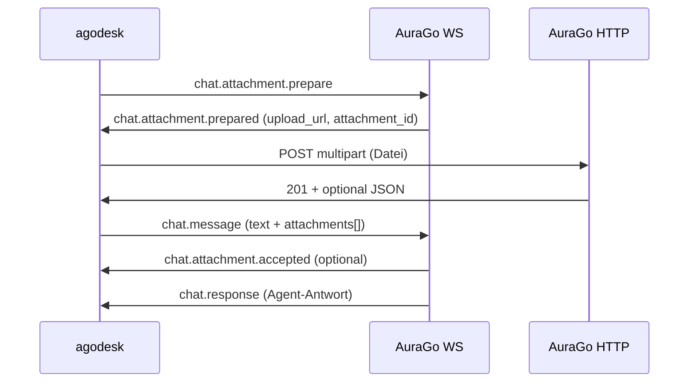

# AuraGo Handoff: Chat-Anhänge (User → Agent)

agodesk kann **heute keine Dateien im Chat an den Agenten senden**. Der Client unterstützt nur:

| Richtung | Feature | Status agodesk |
|----------|---------|----------------|
| Server → Client | `chat.media` (Agent schickt Medien) | ✅ Empfang + Anzeige |
| Agent → User-PC | `remote.files.*` (Dateizugriff auf freigegebene Ordner) | ✅ implementiert |
| Client → Server | Datei an Chat-Nachricht anhängen | ❌ **fehlt** |

Dieses Dokument ist die **Arbeitsanweisung für einen AuraGo-PR**. agodesk implementiert den Client **nach** verhandelbarer Server-Unterstützung (separater agodesk-PR).

---

## Ziel

User wählt eine oder mehrere Dateien in agodesk, lädt sie hoch, und sendet eine `chat.message` mit Text + Attachment-Referenzen. AuraGo speichert die Dateien, injiziert sie in den Agent-Kontext (Vision, Dokument-Parsing, …) und kann sie in der Session-Historie wieder ausliefern.

**Abgrenzung:** Das ist **nicht** `remote.files.read` — kein Zugriff auf beliebige lokale Pfade. Nur explizit hochgeladene Chat-Anhänge.

---

## Design-Prinzipien

1. **Symmetrie zu `chat.media`:** Server-seitige Artefakte nutzen dasselbe `item`-Schema wie eingehende Agent-Medien (`kind`, `path`, `filename`, `mime_type`, …).
2. **Zwei Phasen:** Erst Upload (HTTP), dann `chat.message` mit Referenz — WebSocket bleibt schlank.
3. **Signierte URLs:** Wie bei Agent-Medien: `/api/agodesk/media/...?agodesk_exp=…&agodesk_sig=…` (agodesk kennt dieses Format bereits).
4. **Capability-gated:** Ohne Verhandlung verhält sich der Server wie heute (nur Text-Chat).
5. **Rückwärtskompatibel:** Alte Clients senden weiterhin reine Text-`chat.message`.

---

## Capability-Matrix

| Capability | Richtung | Wer advertised | Bedeutung |
|------------|----------|----------------|-----------|
| `chat.media_events` | Server → Client | Server in `session.accepted` | Client kann `chat.media` empfangen (**bereits live**) |
| `chat.media_upload` | Client → Server | Client in `session.start` | Client kann Anhänge hochladen (**neu**) |
| `chat.attachments` | Server → Client | Server in `session.accepted` | Server akzeptiert Uploads + liefert Attachment-Metadaten in Historie (**neu**) |

**Verhandlung:**

```json
{
  "client_capabilities": [
    "chat.full_response",
    "chat.sessions",
    "chat.media_upload"
  ]
}
```

```json
{
  "advertised_capabilities": [
    "chat.full_response",
    "chat.sessions",
    "chat.media_events",
    "chat.media_upload",
    "chat.attachments"
  ]
}
```

Regeln:

- Server spiegelt `chat.media_upload` nur, wenn Upload-Endpoint aktiv ist.
- `chat.attachments` impliziert `chat.media_upload` (Server-seitig).
- Fehlt `chat.media_upload` in `advertised_capabilities` → agodesk zeigt keinen Anhänge-Button.

Optional in `session.accepted` Limits mitgeben (snake_case):

```json
{
  "attachment_limits": {
    "max_file_bytes": 8388608,
    "max_files_per_message": 5,
    "max_total_bytes_per_message": 25165824,
    "allowed_mime_prefixes": ["image/", "text/", "application/pdf"]
  }
}
```

agodesk kann Limits lokal cachen; Server-Limits sind maßgeblich.

---

## Protokoll-Übersicht



---

## Nachrichten (WebSocket)

### 1. Client → Server: `chat.attachment.prepare`

Reserviert Upload-Slot und liefert signierte Upload-URL.

```json
{
  "id": "prep-550e8400-e29b-41d4-a716-446655440000",
  "type": "chat.attachment.prepare",
  "timestamp": "2026-06-04T12:00:00.000Z",
  "payload": {
    "session_id": "agodesk:device-abc",
    "conversation_id": "sess-7f3a2b",
    "filename": "screenshot.png",
    "mime_type": "image/png",
    "size_bytes": 245760,
    "sha256": "optional-client-hash-hex"
  }
}
```

| Feld | Pflicht | Beschreibung |
|------|---------|--------------|
| `session_id` | ja | Transport-Session aus `session.accepted` |
| `conversation_id` | ja | Shared `sess-*` Chat-Session |
| `filename` | ja | Anzeigename, max. 255 Zeichen |
| `mime_type` | ja | Client-MIME; Server darf ablehnen |
| `size_bytes` | ja | Für Quota-Check vor Upload |
| `sha256` | nein | Optional; Server kann nach Upload verifizieren |

---

### 2. Server → Client: `chat.attachment.prepared`

```json
{
  "id": "prep-resp-660e8400-e29b-41d4-a716-446655440001",
  "type": "chat.attachment.prepared",
  "timestamp": "2026-06-04T12:00:00.100Z",
  "payload": {
    "session_id": "agodesk:device-abc",
    "conversation_id": "sess-7f3a2b",
    "prepare_id": "prep-550e8400-e29b-41d4-a716-446655440000",
    "attachment_id": "att-9c4e1d2f",
    "upload_url": "https://aurago.local:8443/api/agodesk/media/upload/att-9c4e1d2f?agodesk_exp=1717507200&agodesk_sig=…",
    "upload_method": "POST",
    "upload_field": "file",
    "expires_at": "2026-06-04T12:05:00.000Z",
    "max_bytes": 8388608
  }
}
```

| Feld | Beschreibung |
|------|--------------|
| `prepare_id` | Echo der Client-`chat.attachment.prepare.id` |
| `attachment_id` | Stabile ID für `chat.message.attachments` |
| `upload_url` | HTTPS-URL; agodesk nutzt Tauri-HTTP mit TLS-Pinning |
| `upload_method` | Immer `POST` (MVP) |
| `upload_field` | Multipart-Feldname, Default `file` |
| `expires_at` | Upload muss vor Ablauf abgeschlossen sein (z. B. 5 min) |

Bei Fehler: `chat.error` mit Code `ATTACHMENT_REJECTED`, `ATTACHMENT_TOO_LARGE`, `ATTACHMENT_MIME_NOT_ALLOWED`, `SESSION_NOT_FOUND`.

---

### 3. HTTP: Upload

**Endpoint (Vorschlag):** `POST /api/agodesk/media/upload/{attachment_id}`

- Auth: Query-Token wie bei bestehenden Media-URLs (`agodesk_exp`, `agodesk_sig`).
- Body: `multipart/form-data`, Feld `file`.
- Response `201`:

```json
{
  "attachment_id": "att-9c4e1d2f",
  "status": "ready",
  "path": "/api/agodesk/media/att-9c4e1d2f/screenshot.png?agodesk_exp=…&agodesk_sig=…",
  "mime_type": "image/png",
  "size_bytes": 245760,
  "sha256": "…"
}
```

Nach erfolgreichem Upload ist das Artefakt über signierte `path`-URLs abrufbar — **gleiches Muster wie Agent-`chat.media`**.

Referenz-Implementierung (Mock): `scripts/mock-server.mjs` (`signMockAgodeskMediaPath`, `/api/agodesk/media/`).

---

### 4. Client → Server: `chat.message` (erweitert)

Bestehendes Format bleibt; optional `attachments`:

```json
{
  "id": "msg-770e8400-e29b-41d4-a716-446655440002",
  "type": "chat.message",
  "timestamp": "2026-06-04T12:00:02.000Z",
  "payload": {
    "session_id": "agodesk:device-abc",
    "conversation_id": "sess-7f3a2b",
    "text": "Was siehst du auf dem Screenshot?",
    "role": "user",
    "attachments": [
      {
        "attachment_id": "att-9c4e1d2f",
        "filename": "screenshot.png",
        "mime_type": "image/png",
        "size_bytes": 245760,
        "path": "/api/agodesk/media/att-9c4e1d2f/screenshot.png?agodesk_exp=…&agodesk_sig=…",
        "kind": "image"
      }
    ]
  }
}
```

| Feld | Pflicht | Beschreibung |
|------|---------|--------------|
| `text` | nein* | Kann leer sein, wenn nur Anhänge gesendet werden |
| `attachments[]` | nein | 0..N Referenzen auf **bereits hochgeladene** `attachment_id` |
| `attachments[].path` | empfohlen | Signierter Abruf-Pfad aus Upload-Response |
| `attachments[].kind` | empfohlen | Wie `chat.media.item.kind`: `image`, `document`, `audio`, … |

\*Server-Policy: mindestens `text` **oder** mindestens ein Attachment.

**Korrelation:** `chat.message.id` = `request_id` für `chat.response` / `chat.media` (wie heute).

---

### 5. Server → Client: `chat.attachment.accepted` (optional, empfohlen)

Bestätigt, dass alle Referenzen gültig und an den Agent übergeben wurden.

```json
{
  "id": "acc-880e8400-e29b-41d4-a716-446655440003",
  "type": "chat.attachment.accepted",
  "timestamp": "2026-06-04T12:00:02.050Z",
  "payload": {
    "session_id": "agodesk:device-abc",
    "conversation_id": "sess-7f3a2b",
    "request_id": "msg-770e8400-e29b-41d4-a716-446655440002",
    "attachments": [
      {
        "attachment_id": "att-9c4e1d2f",
        "status": "accepted",
        "kind": "image",
        "path": "/api/agodesk/media/att-9c4e1d2f/screenshot.png?agodesk_exp=…&agodesk_sig=…"
      }
    ]
  }
}
```

Bei teilweise ungültigen IDs: `status: "rejected"` pro Item + `chat.error` auf Message-Ebene.

---

### 6. Historie: `chat.session` / geladene Messages

User-Nachrichten in der Historie sollten Attachments zurückgeben (für agodesk-Rehydration):

```json
{
  "role": "user",
  "content": "Was siehst du auf dem Screenshot?",
  "timestamp": "2026-06-04T12:00:02.000Z",
  "attachments": [
    {
      "attachment_id": "att-9c4e1d2f",
      "kind": "image",
      "filename": "screenshot.png",
      "mime_type": "image/png",
      "path": "/api/agodesk/media/att-9c4e1d2f/screenshot.png?agodesk_exp=…&agodesk_sig=…"
    }
  ]
}
```

agodesk rendert User-Anhänge analog zu `ChatMediaBlock` (Vorschau für `image`/`document`).

---

### 7. Alignment mit bestehendem `chat.media` (Server → Client)

Agent-Antworten können weiterhin `chat.media` senden. **Gleiches Item-Schema:**

```json
{
  "type": "chat.media",
  "payload": {
    "session_id": "agodesk:device-abc",
    "conversation_id": "sess-7f3a2b",
    "request_id": "msg-770e8400-e29b-41d4-a716-446655440002",
    "item": {
      "id": "media-uuid",
      "kind": "image",
      "path": "/api/agodesk/media/generated-chart.png?agodesk_exp=…&agodesk_sig=…",
      "title": "Analyse",
      "caption": "Ergebnis der Bildauswertung",
      "mime_type": "image/png",
      "filename": "generated-chart.png"
    }
  }
}
```

agodesk normalisiert in `normalizeChatMediaPayload()` — neue Upload-Pfade sollen **dieselben Pfad-/Signatur-Regeln** verwenden.

---

## AuraGo-Implementierung (Aufgaben)

### 1. WS-Handler registrieren

**Dateien (typisch):** `internal/server/agodesk_handlers.go`, WS-Router für agodesk-Sessions

| Typ | Handler |
|-----|---------|
| `chat.attachment.prepare` | Quota prüfen → `attachment_id` + signierte `upload_url` erzeugen |
| `chat.message` | Bestehend erweitern: `attachments[]` validieren, an Agent-Pipeline übergeben |
| `chat.attachment.accepted` | Nach erfolgreicher Validierung senden (optional) |

Fehlercodes (Vorschlag, analog zu bestehenden `SESSION_*` / `FILE_*`):

| Code | Bedeutung |
|------|-----------|
| `ATTACHMENT_REJECTED` | Allgemein abgelehnt |
| `ATTACHMENT_TOO_LARGE` | `size_bytes` > Limit |
| `ATTACHMENT_MIME_NOT_ALLOWED` | MIME nicht erlaubt |
| `ATTACHMENT_NOT_FOUND` | `attachment_id` unbekannt oder abgelaufen |
| `ATTACHMENT_NOT_READY` | Upload noch nicht abgeschlossen |
| `ATTACHMENT_EXPIRED` | Prepare/Upload-Fenster abgelaufen |

### 2. HTTP-Upload-Endpoint

**Datei (Vorschlag):** `internal/server/agodesk_media_upload.go`

- `POST /api/agodesk/media/upload/{attachment_id}`
- Signatur-Validierung wie bei Media-Download (`agodesk_exp`, `agodesk_sig`)
- Streaming-Schreiben mit hartem Byte-Limit
- Speicherort: pro Session/Conversation isoliert (kein Überschreiben fremder Attachments)
- Nach Upload: Status `ready`, `path` für signierten Download generieren

### 3. Capability-Verhandlung

In `session.accepted`:

- `chat.media_upload` + `chat.attachments` spiegeln, wenn Feature aktiv
- Optional `attachment_limits` im Payload (siehe oben)

In Agent-/Broker-Code: Upload-Feature nicht an Clients ohne Capability anbieten.

### 4. Agent-Kontext

**Datei (Vorschlag):** `internal/agent/` — Message-Assembler vor LLM-Aufruf

| `kind` / MIME | Agent-Verhalten |
|---------------|-----------------|
| `image/*` | Vision / Multimodal-Part (Base64 oder interne URL) |
| `text/*`, `.md`, `.csv` | Als Text in Kontext (max. Zeichen limitieren) |
| `application/pdf` | PDF-Extraktion oder Document-Tool |
| Sonstige Binär | Metadaten + Hinweis „Binary not inlined“; optional Download-Tool für Agent |

In `buildAgodeskAgentContext` ergänzen:

> The user may attach files via chat (not via remote file access). Use attachment metadata and stored paths under `/api/agodesk/media/`. Do not assume attachments are readable from the user's PC via `file_read`.

### 5. Persistenz & Historie

- Attachments an `conversation_id` + Message binden
- `chat.session.load` / Session-Store: User-Messages mit `attachments[]` zurückgeben
- TTL/GC für unreferenzierte Uploads (Prepare ohne Message innerhalb X min löschen)

### 6. Tests

**Datei (Vorschlag):** `internal/server/agodesk_attachments_test.go`

- Prepare → Upload → Message → Accepted (Happy Path)
- Upload ohne Prepare → 401/404
- Message mit fremder `attachment_id` → `ATTACHMENT_NOT_FOUND`
- MIME/Size-Limits
- Capability-Matrix: ohne `chat.media_upload` → Prepare abgelehnt
- Signierte URL abgelaufen → Download 401

```bash
go test ./internal/server/ -run AgodeskAttachment -count=1
```

### 7. Dokumentation AuraGo

**Datei (Vorschlag):** `documentation/agodesk_coding_agent_chat_attachments.md`

- Protokoll, Limits, Fehlercodes
- Unterschied zu `remote.files.*` und zu Web-Chat-Uploads (falls vorhanden: Verhalten angleichen)

---

## agodesk-Seite (folgt nach AuraGo-PR)

| Komponente | Beschreibung |
|------------|--------------|
| `protocol.ts` | `AGODESK_CHAT_MEDIA_UPLOAD_CAPABILITY`, `ChatAttachment*`-Typen, Normalizer |
| `session.start` | `chat.media_upload` in `client_capabilities` wenn Feature-Flag aktiv |
| `chat-outbound.ts` | Prepare → HTTP-Upload → `chat.message` mit `attachments` |
| `InputBox.svelte` | Anhänge-Button, Drag & Drop, Pending-State |
| Tauri | Datei-Dialog + lesen (Größenlimit); Upload via `reqwest`/HTTP-Plugin mit TLS-Pinning |
| UI | User-Bubble mit Vorschau; Historie aus `chat.session` |
| Mock-Server | Prepare/Upload/Message-Flow für lokale Tests |

Referenz-Client-Typen: `src/lib/types/protocol.ts` (`ChatMediaItem`, `normalizeChatMediaPayload`).

---

## Verifikation (End-to-End)

1. agodesk mit AuraGo-Backend verbinden (gepairt).
2. In `session.accepted`: `chat.media_upload`, `chat.attachments` vorhanden.
3. PNG + PDF anhängen, Text senden.
4. WS-Trace: `chat.attachment.prepare` → `prepared` → HTTP 201 → `chat.message` → `chat.response`.
5. Agent antwortet inhaltsbezogen auf Bild/PDF.
6. Chat-Historie laden: Attachments in User-Message sichtbar.
7. Alter Server ohne Capability: agodesk zeigt keinen Anhänge-Button; Text-Chat unverändert.

---

## Risiken

| Risiko | Mitigation |
|--------|------------|
| Große Dateien blockieren WS | Upload nur über HTTP |
| MIME-Spoofing | Server prüft Magic Bytes, nicht nur Client-MIME |
| Quota-Missbrauch | Limits pro Message/Session; Prepare-Expiry |
| Verwechslung mit `file_read` | Klare Agent-Prompts + getrennte Capabilities |
| Signierte URLs leaken | Kurze TTL; agodesk loggt URLs mit Key nicht (bereits Policy für Gemini-WS) |

---

## Troubleshooting

| Symptom | Wahrscheinliche Ursache |
|---------|-------------------------|
| agodesk zeigt keinen Anhänge-Button | `chat.media_upload` fehlt in `advertised_capabilities` |
| `ATTACHMENT_NOT_READY` | `chat.message` vor HTTP-Upload abgeschickt |
| `401` beim Upload | Signatur abgelaufen oder falscher `attachment_id` |
| Agent ignoriert Bild | Agent-Kontext injiziert Attachment nicht (Backend) |
| Vorschau leer in Historie | `chat.session` liefert keine `attachments[]` auf User-Messages |

---

## Referenzen im agodesk-Repo

| Thema | Pfad |
|-------|------|
| Eingehende Medien (`chat.media`) | `src/lib/services/chat-media-flow.ts`, `ChatMediaBlock.svelte` |
| Signierte Media-URLs | `src/lib/services/server-asset-fetch.ts` |
| Chat-Sessions / Outbound | `docs/AURAGO_CHAT_CONTROLS.md` |
| Remote Dateizugriff (separates Feature) | `docs/AURAGO_FILE_SEARCH_HANDOFF.md` |
| Mock Media-Signatur | `scripts/mock-server.mjs` |

---

*Stand: 2026-06-04 — agodesk Client-Upload folgt nach AuraGo-Merge.*
