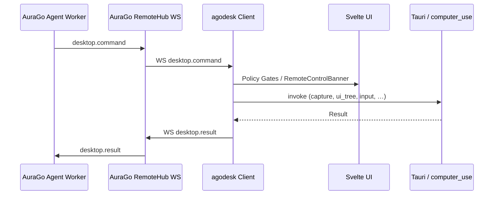

# AuraGo Coding Agent — Computer-Use Integration

Dieses Dokument beschreibt, wie der **agodesk-Client** Computer-Use implementiert und wie **AuraGo** die neuen Features über WebSocket anbinden muss. Es richtet sich an den AuraGo-Coding-Agenten und Backend-Entwickler.

**Verwandte Docs**

| Dokument | Inhalt |
|----------|--------|
| [BACKEND_PROTOCOL.md](./BACKEND_PROTOCOL.md) | Vollständiger WS-Vertrag (Pairing, Chat, Desktop v1) |
| [aurago/README.md](./aurago/README.md) | Referenz-Typen, JSON-Beispiele, Agent-Worker-Skizze |
| [aurago/protocol-examples.json](./aurago/protocol-examples.json) | Kopierbare Payloads |
| `src/lib/types/protocol.ts` | Kanonische TypeScript-Typen (Client) |

---

## 1. Architektur



**Wichtig:** Der Plan/Act/Observe-Loop liegt **in AuraGo**. agodesk führt nur **atomare** Operationen aus und liefert strukturierte Ergebnisse zurück.

---

## 2. Capability-Verhandlung (Pflicht für AuraGo)

### 2.1 Client sendet Fähigkeiten

Bei `session.start` sendet agodesk `client_capabilities` (gebaut in `session-start.ts` → `agodeskClientCapabilities()`):

| Client-Einstellung | Capability-Strings |
|--------------------|-------------------|
| Immer | `chat.full_response`, `persona.assets` |
| `desktopControlEnabled` | `remote.desktop.capture`, `remote.desktop.permission_request`, `remote.desktop.input`, `remote.desktop.discovery`, `remote.desktop.ui_automation` |
| + `browserControlEnabled` | `remote.desktop.browser` |
| Dateizugriff konfiguriert | `remote.files.read`, `remote.files.write` |

Beispiel-Payload:

```json
{
  "client_version": "0.1.0",
  "client_capabilities": [
    "chat.full_response",
    "remote.desktop.capture",
    "remote.desktop.permission_request",
    "remote.desktop.input",
    "remote.desktop.discovery",
    "remote.desktop.ui_automation",
    "persona.assets"
  ],
  "host": { "hostname": "…", "os": "windows", "arch": "x86_64" }
}
```

### 2.2 AuraGo MUSS spiegeln: `advertised_capabilities`

In `session.accepted` **muss** AuraGo die verhandelten Desktop-Capabilities zurückgeben:

```json
{
  "session_id": "sess-acc-…",
  "device_id": "dev-…",
  "advertised_capabilities": [
    "remote.desktop.capture",
    "remote.desktop.discovery",
    "remote.desktop.ui_automation"
  ]
}
```

**Ohne `remote.desktop.capture` in `advertised_capabilities`** zeigt die agodesk-UI „Remote Desktop nicht registriert“ (StatusBar, ChatView), auch wenn der Client die Ops ausführen könnte.

**AuraGo-Implementierung:**

1. `client_capabilities` aus `session.start` lesen
2. Mit Server-Policy schneiden (Gerät freigegeben? Tenant erlaubt Browser?)
3. Schnittmenge in `session.accepted.advertised_capabilities` zurückgeben
4. Agent-Worker nur Ops senden, deren Capability angekündigt wurde

Referenz: `normalizeSessionAcceptedPayload()` in `protocol.ts`, UI-Check `hasAdvertisedRemoteDesktopCapture()`.

---

## 3. Device-Approval (AuraGo Admin)

Zusätzlich zu agodesk-internen Bannern muss das **agodesk-Gerät in AuraGo Remote Control freigegeben** sein. Ohne Freigabe antwortet der Agent typischerweise mit „device is not approved“ und sendet keine `desktop.command`-Frames.

---

## 4. Freigabe-Modell im agodesk-Frontend

| Operation | Remote-Control-Banner | Setting |
|-----------|----------------------|---------|
| `desktop_screenshot` | **Nein** | `desktopControlEnabled` |
| `desktop_list_*`, `desktop_active_window`, `desktop_host_info` | **Nein** | `desktopControlEnabled` |
| `desktop_ui_tree` | **Nein** | `desktopControlEnabled` |
| `desktop_permission_request` | Banner anzeigen (kein Block) | — |
| `desktop_input` | **Ja** | `desktopControlEnabled` |
| `desktop_ui_action` | **Ja** | `desktopControlEnabled` |
| `desktop_browser_*` | Connect/Snapshot/Disconnect: nein; **Action: Ja** | `browserControlEnabled` |

**Client-Implementierung**

| Schicht | Datei | Funktion |
|---------|--------|----------|
| WS-Eingang | `ChatView.svelte` | `handleIncomingMessage` → `handleIncomingDesktopCommand` |
| Policy | `desktop-flow.ts` | `handleIncomingDesktopCommand`, `flushPendingInputCommands` |
| Banner-UI | `RemoteControlBanner.svelte` | Approve/Deny/Stop |
| Ausführung | `desktop.ts` | `executeDesktopCommand` |
| Settings | `SettingsView.svelte` | `desktopControlEnabled`, `browserControlEnabled` |

**Input-Queue:** Wenn `desktop_input`, `desktop_ui_action` oder `desktop_browser_action` ankommen und der Banner nicht aktiv ist, werden Commands in `pendingInputCommands` gequeue't. Nach Klick auf „Freigeben“ ruft `flushPendingInputCommands()` die Queue ab.

**AuraGo-Verhalten bei `DESKTOP_INPUT_NOT_APPROVED`:**

1. Optional `desktop_permission_request` senden (triggert Banner)
2. Auf `desktop.result` mit Erfolg warten **oder** auf erneuten User-Approve warten
3. Gleichen `command_id` oder neuen Command erneut senden

---

## 5. Nachrichtenformat

### 5.1 Envelope (beide Richtungen)

```json
{
  "id": "<uuid>",
  "type": "desktop.command",
  "timestamp": "2026-06-04T12:00:00.000Z",
  "payload": { }
}
```

Snake_case und camelCase werden im Client normalisiert (`command_id` / `commandId`, `display_id` / `displayId`, …).

### 5.2 Server → Client: `desktop.command`

```json
{
  "command_id": "<uuid-eindeutig-pro-request>",
  "operation": "desktop_ui_tree",
  "params": { "window_id": "win-12345678" }
}
```

### 5.3 Client → Server: `desktop.result`

```json
{
  "command_id": "<gleiche-id-wie-command>",
  "success": true,
  "status": "ok",
  "session_id": "sess-acc-…",
  "device_id": "dev-…",
  "data": { },
  "error": null,
  "error_code": null
}
```

Bei Fehler: `success: false`, `status: "error"`, `error_code` gesetzt (maschinenlesbar).

---

## 6. Operationen — Referenz für AuraGo

### 6.1 Discovery (`remote.desktop.discovery`)

| Operation | params | `data` bei Erfolg |
|-----------|--------|-------------------|
| `desktop_list_displays` | `{}` | `{ "displays": DisplayInfo[] }` |
| `desktop_list_windows` | `{}` | `{ "windows": WindowInfo[] }` |
| `desktop_active_window` | `{}` | `ActiveWindowInfo` (flach) |
| `desktop_host_info` | `{}` | `{ hostname, platform, arch, … }` |

**DisplayInfo:** `id` (`display-0`, …), `width`, `height`, `x`, `y`, `primary`, `scale_factor`

**WindowInfo:** `id` (`win-<hwnd>`), `title`, `display_id`, `monitor_index`, …

**ActiveWindowInfo:** `id`, `title`, `process_name`, `process_path`, Bounds, `display_id`

### 6.2 Capture (`remote.desktop.capture`)

**`desktop_screenshot`**

```json
{
  "display_id": "display-0",
  "window_id": null,
  "format": "jpeg",
  "quality": 75
}
```

`data`: `source`, `display_id`, `window_id`, `width`, `height`, `scale_factor`, `mime`, `data_base64`

Default: JPEG quality 75, max. Kantenlänge ~1280 px (Payload-Größe).

### 6.3 Input (`remote.desktop.input`)

**`desktop_input`** — `params.kind`:

| kind | params |
|------|--------|
| `mouse_move` | `{ x, y, absolute?: true }` |
| `mouse_click` | `{ x, y, button: "left"\|"right"\|"middle", action: "click"\|"down"\|"up" }` |
| `mouse_scroll` | `{ x, y, delta?, direction?: "up"\|"down"\|"left"\|"right" }` |
| `mouse_drag` | `{ from_x, from_y, to_x, to_y, button? }` |
| `key_combo` | `{ keys: ["ctrl", "c"] }` |
| `key_down` / `key_up` | `{ key }` oder `{ code }` |
| `text` | `{ text }` |

Implementierung: **enigo** in `src-tauri/src/computer_use/input.rs`.

### 6.4 UI-Automation (`remote.desktop.ui_automation`)

**`desktop_ui_tree`**

```json
{ "window_id": "win-12345678" }
```

Ohne `window_id`: aktives Fenster / Root.

**`data`:**

```json
{
  "window_id": "win-12345678",
  "truncated": false,
  "element_count": 142,
  "root": {
    "id": "elem-0",
    "role": "Window",
    "name": "VS Code",
    "automation_id": null,
    "bounds": { "x": 0, "y": 0, "width": 1920, "height": 1080 },
    "interactive": true,
    "enabled": true,
    "visible": true,
    "children": []
  }
}
```

`element_id` ist stabil pro Session (Hash aus Fenster + AutomationId + Pfad auf Windows).

**`desktop_ui_action`**

```json
{
  "element_id": "elem-42",
  "action": "click",
  "value": "optional für set_value",
  "window_id": "optional"
}
```

Actions: `click`, `invoke`, `focus`, `set_value`

**Plattformen**

| OS | UI-Tree | Hinweis |
|----|---------|---------|
| Windows | uiautomation | Vollständig |
| Linux | AT-SPI (echter Accessibility-Baum) | Wayland/X11-Einschränkungen je Desktop; AT-SPI muss aktiv sein |
| macOS | AXUIElement (Accessibility API) | Berechtigung unter Systemeinstellungen → Datenschutz → Bedienungshilfen erforderlich |

### 6.5 Browser CDP (`remote.desktop.browser`)

Erfordert Client-Setting **`browserControlEnabled`** und Capability `remote.desktop.browser`.

| Operation | params | Banner |
|-----------|--------|--------|
| `desktop_browser_connect` | `{ endpoint?, port?, auto_launch?, url? }` | Nein |
| `desktop_browser_list_tabs` | `{}` | Nein |
| `desktop_browser_snapshot` | `{ selector?, include_html?, include_screenshot?, screenshot_format?, quality?, full_page?, tab_id? }` | Nein |
| `desktop_browser_action` | `{ action, selector?, tab_id?, value? }` | **Ja** (Tab-Actions `select_tab`/`new_tab`/`close_tab` ohne Banner) |
| `desktop_browser_disconnect` | `{}` | Nein |

**Connect-Parameter:**

- `endpoint` — z. B. `http://127.0.0.1:9222` (nur Loopback: `127.0.0.1`, `localhost`, `::1`)
- `port` — Alternative zu `endpoint` (Default `9222` → `http://127.0.0.1:{port}`)
- `auto_launch` — Default `true`: bei fehlgeschlagem Attach startet agodesk Chrome/Edge mit `--remote-debugging-port`
- `url` — Start-URL beim Auto-Launch

**Actions (v2):** `click`, `focus`, `fill` / `set_value`, `type`, `press` (value = Taste, Default `Enter`); Tab-Steuerung: `select_tab` (`tab_id`), `new_tab` (`value` = URL, optional), `close_tab` (`tab_id`)

**Snapshot:** `text`, optional `html` (max. ~512 KiB, dann `truncated: true`); optional CDP-Screenshot via `include_screenshot: true` mit `screenshot_format` (`jpeg`\|`png`\|`webp`), `quality` (40–90), `full_page`, `tab_id`

**Tabs:** `desktop_browser_list_tabs` → `{ tabs: [{ id, url, title, active }], active_tab_id }`. Connect-Response enthält `active_tab_id`.

**Disconnect:** Beendet bei Auto-Launch den gestarteten Browser-Prozess.

CDP: Cargo-Feature `browser-automation` (chromiumoxide, standardmäßig aktiv). Manuell: `chrome.exe --remote-debugging-port=9222`

**Settings:** Unter Desktop → „Browser-Verbindung testen“ (CDP-Attach/Auto-Launch auf Port 9222, danach Disconnect).

**macOS Auto-Launch:** Chrome/Edge/Chromium/Brave unter `/Applications` und `~/Applications`; Debug-Port bindet an `127.0.0.1`.

### 6.6 Desktop-Stream (periodische Screenshots)

Erfordert Capability **`remote.desktop.stream`** in `session.start` (agodesk advertised automatisch bei aktivierter Desktop-Steuerung).

| Operation | params | Antwort |
|-----------|--------|---------|
| `desktop_stream_start` | `display_id?`, `window_id?`, `format?` (`jpeg`\|`png`), `quality?` (40–90), `fps?` (1–10, Default 2) | `desktop.result` mit `{ stream_id, active: true, fps, format, display_id?, window_id? }` |
| `desktop_stream_stop` | `stream_id?` (optional; ohne ID stoppt den aktiven Stream) | `desktop.result` mit `{ stream_id, active: false, frames_sent }` |

Während ein Stream aktiv ist, sendet agodesk **unsolicited** WebSocket-Nachrichten:

```json
{
  "type": "desktop.stream.frame",
  "payload": {
    "stream_id": "uuid",
    "sequence": 1,
    "timestamp": "2026-06-04T12:00:00.000Z",
    "session_id": "sess-acc-…",
    "device_id": "dev-…",
    "frame": {
      "source": "display",
      "display_id": "display-0",
      "window_id": null,
      "format": "jpeg",
      "width": 1920,
      "height": 1080,
      "scale_factor": 1,
      "mime": "image/jpeg",
      "data_base64": "…"
    }
  }
}
```

- Kein Remote-Control-Banner nötig (wie `desktop_screenshot`)
- Ein neuer `desktop_stream_start` ersetzt einen laufenden Stream
- Stream endet bei Disconnect, Session-Reset oder `desktop_stream_stop`

### 6.7 Permission-Probe

**`desktop_permission_request`** → `data`:

```json
{
  "screen_capture": true,
  "input_injection": true,
  "approved_session": false,
  "ui_automation": true,
  "browser_automation": true
}
```

---

## 7. Fehlercodes (AuraGo-Handling)

| Code | Bedeutung | Agent-Aktion |
|------|-----------|--------------|
| `SESSION_NOT_ACCEPTED` | Vor Pairing | Warten / Pairing |
| `DESKTOP_CONTROL_DISABLED` | User hat Desktop aus | User informieren |
| `DESKTOP_BROWSER_UNAVAILABLE` | Browser-Setting aus | User informieren |
| `DESKTOP_INPUT_NOT_APPROVED` | Banner nicht freigegeben | Permission + Retry |
| `DESKTOP_INPUT_DENIED` | User abgelehnt | Abbrechen |
| `DESKTOP_UI_UNAVAILABLE` | Keine Accessibility | Fallback: Screenshot + `desktop_input` |
| `DESKTOP_ELEMENT_NOT_FOUND` | `element_id` ungültig | UI-Tree neu laden |
| `DESKTOP_ACCESSIBILITY_DENIED` | OS-Berechtigung fehlt | User informieren |
| `DESKTOP_OPERATION_UNSUPPORTED` | Op/Plattform | Anderen Pfad wählen |
| `DESKTOP_STREAM_NOT_ACTIVE` | `desktop_stream_stop` ohne laufenden Stream | Erst `desktop_stream_start` |

---

## 8. Empfohlener Agent-Loop (AuraGo)

```text
1. OBSERVE
   desktop_active_window
   desktop_ui_tree (window_id aus active)
   optional: desktop_list_displays / desktop_list_windows

2. PLAN (LLM in AuraGo)
   element_id aus UI-Tree wählen ODER Pixel-Fallback planen

3. ACT
   bevorzugt: desktop_ui_action (click / set_value)
   fallback:  desktop_input (mouse_click, text, key_combo)
   bei Input:   ggf. desktop_permission_request → auf Banner warten

4. VERIFY
   desktop_screenshot (jpeg, display_id aus active)

5. REPEAT oder chat.response an User
```

Referenz-Code: [aurago/agent-worker.example.ts](./aurago/agent-worker.example.ts)

---

## 9. AuraGo-Implementierungs-Checkliste

### RemoteHub / WS-Handler

- [ ] `session.start`: `client_capabilities` parsen und speichern pro `device_id`
- [ ] `session.accepted`: `advertised_capabilities` = Schnittmenge (Client ∩ Server-Policy)
- [ ] Device muss in Remote-Control-Admin **approved** sein
- [ ] `desktop.command` an verbundenen agodesk-Client routen
- [ ] `desktop.result` an Agent-Worker korrelieren (`command_id`)

### Agent Worker

- [ ] Capability-Map: Op nur senden wenn Capability vorhanden (siehe `CAPABILITY_OPERATIONS` in `agodesk-remote-client.interface.ts`)
- [ ] Retry-Logik für `DESKTOP_INPUT_NOT_APPROVED`
- [ ] UI-Tree truncating beachten (`truncated: true` → ggf. gezielt nachladen)
- [ ] Screenshots als Base64-JPEG an Vision-Modell oder speichern
- [ ] Browser-Ops nur wenn `remote.desktop.browser` advertised

### Tests gegen agodesk

```powershell
npm run mock-server   # ws://localhost:8080/api/agodesk/ws
npm run tauri dev
```

Mock-Chat-Befehle: `/displays`, `/windows`, `/active`, `/host`, `/ui-tree`, `/ui-action`, `/browser`, `/computer-use`

Der Mock spiegelt `client_capabilities` → `advertised_capabilities` wie Produktion.

---

## 10. Rust-Seite (nur zur Einordnung)

| Modul | Rolle |
|-------|--------|
| `src-tauri/src/desktop/` | Capture, Fensterliste, Permission |
| `src-tauri/src/computer_use/` | UI-Tree, Input (enigo), Browser, Context |
| `src-tauri/src/commands.rs` | Tauri invoke bridge |
| `src-tauri/src/bin/agodesk_worker.rs` | Optional Sidecar (`AGODESK_COMPUTER_USE_SIDECAR=1`) |

AuraGo kommuniziert **nur** über WebSocket — nicht direkt mit Rust.

---

## 11. Versionierung

- Protokoll: `agodesk.v1`
- Client-Version: `0.1.0` (`AGODESK_CLIENT_VERSION`)
- Breaking Changes: neue Ops sind additive Erweiterungen; alte Clients ignorieren unbekannte Ops mit `DESKTOP_OPERATION_UNSUPPORTED`

---

*Stand: agodesk 0.1.0 — Computer-Use (Windows voll, Linux AT-SPI, macOS AX)*
