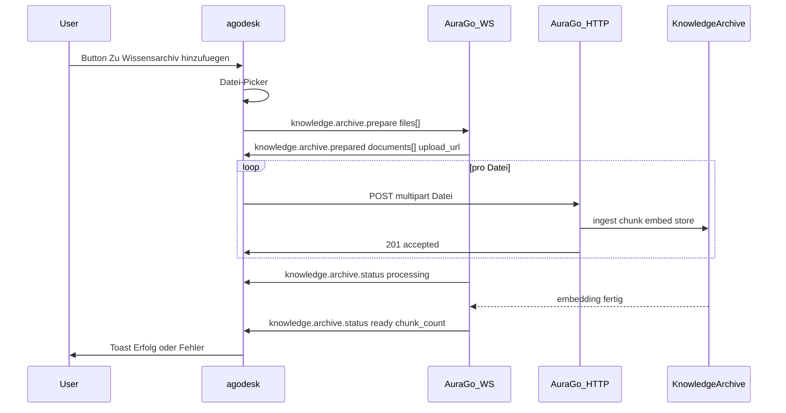

# AuraGo Handoff: Wissensarchiv-Upload (Dokumente → Embeddings)

agodesk soll Dokumente über einen **eigenen Button** „Zu Wissensarchiv hinzufügen“ in das **bestehende AuraGo-Wissensarchiv** hochladen können. Dort werden sie in Embeddings umgewandelt und persistent gespeichert (RAG-Suche).

| Richtung | Feature | Status agodesk |
|----------|---------|----------------|
| Client → Server | Dokument ins Wissensarchiv hochladen (Embeddings) | ⏳ Client folgt nach AuraGo-PR |
| Client → Server | Datei an Chat-Nachricht anhängen (`chat.attachment.*`) | ✅ vorhanden (**anderes Feature**) |
| Server → Client | `chat.media` (Agent schickt Medien) | ✅ Empfang + Anzeige |

Dieses Dokument ist die **Arbeitsanweisung für einen AuraGo-PR**. agodesk implementiert den Client parallel; der Button erscheint erst, wenn AuraGo die Capability `knowledge.archive.upload` in `session.accepted` spiegelt.

---

## Ziel

Der User wählt in agodesk (separater Button, eigener Datei-Picker) ein oder mehrere Dokumente aus. agodesk lädt sie hoch; AuraGo reicht die Bytes an die **vorhandene Ingest-/Embedding-Pipeline des Wissensarchivs** weiter (chunk → embed → store). Die Dokumente landen im **gleichen Wissensarchiv wie die bestehende AuraGo-Web-UI** und sind anschließend per Embedding-Suche auffindbar.

**Abgrenzung (wichtig):**

- ≠ `chat.attachment.*` — das sind **Session-Anhänge** für den Agent-Kontext, kein persistentes Archiv.
- ≠ `remote.files.*` — kein Zugriff auf beliebige lokale Pfade des Users.
- ≠ `local.agent` Memory-Tools (`memory_search` / `memory_get` = **Lesen**; `local.agent.turn` = Journal-Sync). Dies hier ist ein **Schreib-/Ingest-Pfad** ins Wissensarchiv.

---

## Design-Prinzipien

1. **Getrennter Flow:** Eigene Message-Typen `knowledge.archive.*` und eigene Capability. Kein Mischen in `chat.message`.
2. **Zwei Phasen:** Erst `prepare` (WS) → signierte Upload-URL, dann Upload (HTTP), dann asynchroner `status` (WS). WebSocket bleibt schlank.
3. **Signierte URLs:** Gleiches Muster wie Media-/Attachment-Uploads: `/api/agodesk/...?agodesk_exp=…&agodesk_sig=…`.
4. **Bestehendes Archiv wiederverwenden:** Kein neuer Vektor-Store; an die vorhandene Knowledge-Pipeline andocken.
5. **Capability-gated & rückwärtskompatibel:** Ohne Verhandlung zeigt agodesk keinen Button; alte Server bleiben unverändert.

---

## Capability-Matrix

| Capability | Richtung | Wer advertised | Bedeutung |
|------------|----------|----------------|-----------|
| `knowledge.archive.upload` | Client → Server | Client in `session.start` | Client kann Dokumente ins Wissensarchiv hochladen (**neu**) |
| `knowledge.archive.upload` | Server → Client | Server in `session.accepted` | Server akzeptiert Ingest-Uploads + liefert Status (**neu**) |

**Verhandlung:**

```json
{
  "client_capabilities": [
    "chat.full_response",
    "chat.sessions",
    "knowledge.archive.upload"
  ]
}
```

```json
{
  "advertised_capabilities": [
    "chat.full_response",
    "chat.sessions",
    "knowledge.archive.upload"
  ]
}
```

Regeln:

- Server spiegelt `knowledge.archive.upload` nur, wenn Ingest-Endpoint + Pipeline aktiv sind.
- Fehlt `knowledge.archive.upload` in `advertised_capabilities` → agodesk zeigt **keinen** „Zu Wissensarchiv hinzufügen“-Button.

Optional in `session.accepted` Limits mitgeben (snake_case):

```json
{
  "knowledge_archive_limits": {
    "max_file_bytes": 20971520,
    "max_files_per_batch": 10,
    "allowed_mime_prefixes": [
      "application/pdf",
      "text/",
      "application/vnd.openxmlformats-officedocument",
      "application/msword",
      "application/json",
      "text/markdown"
    ]
  }
}
```

agodesk cacht Limits lokal; Server-Limits sind maßgeblich.

---

## Protokoll-Übersicht



---

## Nachrichten (WebSocket)

### 1. Client → Server: `knowledge.archive.prepare`

Reserviert Upload-Slots für einen Batch und liefert signierte Upload-URLs.

```json
{
  "id": "kaprep-550e8400-e29b-41d4-a716-446655440000",
  "type": "knowledge.archive.prepare",
  "timestamp": "2026-07-18T12:00:00.000Z",
  "payload": {
    "session_id": "agodesk:device-abc",
    "files": [
      {
        "filename": "handbuch.pdf",
        "mime_type": "application/pdf",
        "size_bytes": 245760,
        "title": "Produkthandbuch",
        "tags": ["produkt", "handbuch"]
      }
    ]
  }
}
```

| Feld | Pflicht | Beschreibung |
|------|---------|--------------|
| `session_id` | ja | Transport-Session aus `session.accepted` |
| `files[]` | ja | 1..N Dokumente im Batch |
| `files[].filename` | ja | Anzeigename, max. 255 Zeichen |
| `files[].mime_type` | ja | Client-MIME; Server darf ablehnen |
| `files[].size_bytes` | ja | Für Quota-Check vor Upload |
| `files[].title` | nein | Optionaler Titel im Wissensarchiv (Default: Dateiname) |
| `files[].tags` | nein | Optionale Tags/Labels für das Archiv |

---

### 2. Server → Client: `knowledge.archive.prepared`

```json
{
  "id": "kaprep-resp-660e8400-e29b-41d4-a716-446655440001",
  "type": "knowledge.archive.prepared",
  "timestamp": "2026-07-18T12:00:00.100Z",
  "payload": {
    "session_id": "agodesk:device-abc",
    "prepare_id": "kaprep-550e8400-e29b-41d4-a716-446655440000",
    "documents": [
      {
        "document_id": "kdoc-9c4e1d2f",
        "filename": "handbuch.pdf",
        "upload_url": "https://aurago.local:8443/api/agodesk/knowledge/upload/kdoc-9c4e1d2f?agodesk_exp=1717507200&agodesk_sig=…",
        "upload_method": "POST",
        "upload_field": "file",
        "expires_at": "2026-07-18T12:05:00.000Z",
        "max_bytes": 20971520
      }
    ]
  }
}
```

| Feld | Beschreibung |
|------|--------------|
| `prepare_id` | Echo der Client-`knowledge.archive.prepare.id` |
| `documents[].document_id` | Stabile ID im Wissensarchiv |
| `documents[].upload_url` | HTTPS-URL; agodesk nutzt Tauri-HTTP mit TLS-Pinning |
| `documents[].upload_method` | Immer `POST` (MVP) |
| `documents[].upload_field` | Multipart-Feldname, Default `file` |
| `documents[].expires_at` | Upload muss vor Ablauf abgeschlossen sein (z. B. 5 min) |
| `documents[].max_bytes` | Hard-Limit pro Datei |

Bei Fehler: `chat.error` (oder `knowledge.archive.status` mit `state:"failed"`) mit Code `KNOWLEDGE_REJECTED`, `KNOWLEDGE_TOO_LARGE`, `KNOWLEDGE_MIME_NOT_ALLOWED`, `SESSION_NOT_FOUND`.

---

### 3. HTTP: Upload

**Endpoint (Vorschlag):** `POST /api/agodesk/knowledge/upload/{document_id}`

- Auth: Query-Token wie bei bestehenden Media-URLs (`agodesk_exp`, `agodesk_sig`).
- Body: `multipart/form-data`, Feld `file`.
- Response `201`:

```json
{
  "document_id": "kdoc-9c4e1d2f",
  "state": "processing",
  "filename": "handbuch.pdf",
  "mime_type": "application/pdf",
  "size_bytes": 245760
}
```

Nach Annahme startet die Ingest-/Embedding-Pipeline (chunk → embed → store) **asynchron**. Endzustand kommt via `knowledge.archive.status`.

---

### 4. Server → Client: `knowledge.archive.status`

Asynchrone Zustandsmeldung pro Dokument (mind. einmal `ready` oder `failed`).

```json
{
  "id": "kastat-770e8400-e29b-41d4-a716-446655440002",
  "type": "knowledge.archive.status",
  "timestamp": "2026-07-18T12:00:05.000Z",
  "payload": {
    "session_id": "agodesk:device-abc",
    "document_id": "kdoc-9c4e1d2f",
    "state": "ready",
    "title": "Produkthandbuch",
    "chunk_count": 42
  }
}
```

| Feld | Pflicht | Beschreibung |
|------|---------|--------------|
| `document_id` | ja | Referenz aus `prepared` |
| `state` | ja | `uploading` \| `processing` \| `ready` \| `failed` |
| `error` | bei `failed` | Menschlich lesbarer Grund |
| `chunk_count` | bei `ready` | Anzahl erzeugter Embedding-Chunks (optional) |
| `title` | nein | Finaler Titel im Archiv |

---

## AuraGo-Implementierung (Aufgaben)

### 1. WS-Handler registrieren

**Dateien (typisch):** `internal/server/agodesk_handlers.go`, WS-Router für agodesk-Sessions

| Typ | Handler |
|-----|---------|
| `knowledge.archive.prepare` | Quota/MIME prüfen → pro Datei `document_id` + signierte `upload_url` erzeugen → `knowledge.archive.prepared` |
| `knowledge.archive.status` | Nach Ingest/Embedding senden (`processing` → `ready`/`failed`) |

Fehlercodes (Vorschlag, analog zu bestehenden `ATTACHMENT_*`):

| Code | Bedeutung |
|------|-----------|
| `KNOWLEDGE_REJECTED` | Allgemein abgelehnt |
| `KNOWLEDGE_TOO_LARGE` | `size_bytes` > Limit |
| `KNOWLEDGE_MIME_NOT_ALLOWED` | MIME nicht erlaubt |
| `KNOWLEDGE_NOT_FOUND` | `document_id` unbekannt oder abgelaufen |
| `KNOWLEDGE_EXPIRED` | Prepare/Upload-Fenster abgelaufen |
| `KNOWLEDGE_INGEST_FAILED` | Pipeline-/Embedding-Fehler |

### 2. HTTP-Upload-Endpoint

**Datei (Vorschlag):** `internal/server/agodesk_knowledge_upload.go`

- `POST /api/agodesk/knowledge/upload/{document_id}`
- Signatur-Validierung wie bei Media-Download (`agodesk_exp`, `agodesk_sig`)
- Streaming-Schreiben mit hartem Byte-Limit; MIME per Magic Bytes verifizieren
- Nach Annahme: `state:"processing"`, Ingest asynchron anstoßen

### 3. Anbindung an das bestehende Wissensarchiv (Kern!)

**Datei (Vorschlag):** vorhandenes Knowledge-/RAG-Paket (z. B. `internal/knowledge/…`)

- **Keine** neue Pipeline bauen. Die **gleiche** Ingest-Funktion nutzen, die auch die AuraGo-Web-UI beim Hochladen eines Dokuments verwendet (Parsing → Chunking → Embedding → Vektor-/Dokumentenstore).
- Dokumente demselben Owner/Workspace/Knowledge-Space zuordnen wie die gepairte AuraGo-Identität der Session (damit sie in derselben Suche erscheinen).
- Nach Abschluss `chunk_count` und finalen `title` an den `knowledge.archive.status`-Sender zurückgeben.

### 4. Capability-Verhandlung

In `session.accepted`:

- `knowledge.archive.upload` spiegeln, wenn Feature aktiv
- Optional `knowledge_archive_limits` im Payload (siehe oben)

### 5. Persistenz & GC

- Dokumente an den Knowledge-Space der Identität binden (nicht an die flüchtige Transport-Session).
- TTL/GC für `prepare` ohne Upload (nach X min verwerfen).

### 6. Tests

**Datei (Vorschlag):** `internal/server/agodesk_knowledge_test.go`

- Prepare → Upload → `status: ready` (Happy Path, Dokument im Archiv suchbar)
- Upload ohne Prepare → 401/404
- MIME/Size-Limits → `KNOWLEDGE_*`
- Capability-Matrix: ohne `knowledge.archive.upload` → Prepare abgelehnt
- Signierte URL abgelaufen → Download/Upload 401
- Ingest-Fehler → `status: failed` mit `error`

```bash
go test ./internal/server/ -run AgodeskKnowledge -count=1
```

### 7. Dokumentation AuraGo

**Datei (Vorschlag):** `documentation/agodesk_coding_agent_knowledge_archive.md`

- Protokoll, Limits, Fehlercodes
- Abgrenzung zu `chat.attachment.*`, `remote.files.*`, `local.agent`
- Verweis auf die wiederverwendete Knowledge-Pipeline

---

## agodesk-Seite (parallel, gated an Capability)

| Komponente | Beschreibung |
|------------|--------------|
| `src/lib/types/protocol.ts` | `AGODESK_KNOWLEDGE_ARCHIVE_UPLOAD_CAPABILITY`, `KnowledgeArchive*`-Typen + Normalizer, `knowledge_archive_limits` in `session.accepted` |
| `src/lib/services/session-start.ts` | `knowledge.archive.upload` in `client_capabilities` |
| `src/lib/services/knowledge-archive-flow.ts` | Prepare → HTTP-Upload → `status` sammeln |
| `src/lib/services/knowledge-archive-upload.ts` | Multipart-Upload (Reuse Tauri `upload_chat_attachment` + TLS-Pinning) |
| `src/lib/components/InputBox.svelte` | Separater Button „Zu Wissensarchiv hinzufügen“ + versteckter File-Picker |
| `src/lib/components/ChatView.svelte` | Capability-Gating + Toasts (Processing/Ready/Failed) |
| i18n | Button-Label, Titel, Fehler, Erfolg (`en`/`de` direkt, Rest via Patch-Skript) |

Referenz-Client-Muster: `src/lib/services/chat-attachment-flow.ts`, `chat-attachment-upload.ts`.

---

## Verifikation (End-to-End)

1. agodesk mit AuraGo-Backend verbinden (gepairt).
2. In `session.accepted`: `knowledge.archive.upload` vorhanden.
3. Button „Zu Wissensarchiv hinzufügen“ sichtbar; PDF wählen.
4. WS-Trace: `knowledge.archive.prepare` → `prepared` → HTTP 201 → `knowledge.archive.status: processing` → `ready`.
5. In der AuraGo-Web-UI / per Embedding-Suche: Dokument ist im Wissensarchiv auffindbar.
6. Alter Server ohne Capability: agodesk zeigt keinen Button.

---

## Risiken

| Risiko | Mitigation |
|--------|------------|
| Große Dateien blockieren WS | Upload nur über HTTP |
| MIME-Spoofing | Server prüft Magic Bytes, nicht nur Client-MIME |
| Verwechslung mit Chat-Anhang | Getrennte Capability + Message-Typen + UI-Button |
| Dokumente im falschen Knowledge-Space | An gepairte Identität binden, nicht an Transport-Session |
| Embedding-Pipeline langsam | Async-Ingest + `status`-Events; Client blockiert nicht |
| Signierte URLs leaken | Kurze TTL; agodesk loggt URLs mit Key nicht |

---

## Troubleshooting

| Symptom | Wahrscheinliche Ursache |
|---------|-------------------------|
| Kein Button in agodesk | `knowledge.archive.upload` fehlt in `advertised_capabilities` |
| `401` beim Upload | Signatur abgelaufen oder falscher `document_id` |
| `status: failed` | Ingest/Embedding-Fehler (`error` prüfen) |
| Dokument nicht in Suche | Falscher Knowledge-Space/Owner-Zuordnung im Backend |
| Timeout nach Upload | Kein `knowledge.archive.status` gesendet |

---

## Referenzen im agodesk-Repo

| Thema | Pfad |
|-------|------|
| Chat-Anhänge (getrenntes Feature) | `docs/AURAGO_CHAT_ATTACHMENTS_HANDOFF.md` |
| Signierte Media-URLs | `src/lib/services/server-asset-fetch.ts` |
| Prepare/Upload-Muster | `src/lib/services/chat-attachment-flow.ts`, `chat-attachment-upload.ts` |
| Protokoll-Contract | `docs/aurago_backend_protocol.md` |
| Mock Media-Signatur | `scripts/mock-server.mjs` |

---

*Stand: 2026-07-18 — agodesk Client-Upload gated an AuraGo-Capability `knowledge.archive.upload`.*
