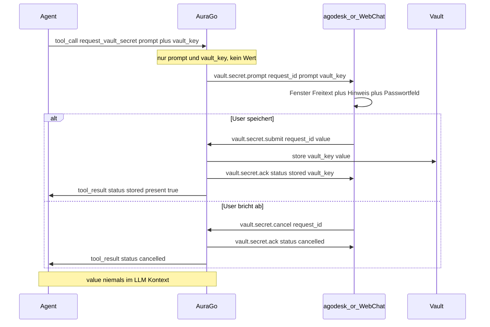

# AuraGo Handoff: Vault-Secret-Eingabe (Agent sieht das Secret nie)

Der AuraGo-Agent soll den User um ein Geheimnis (z. B. einen API-Key) bitten können, **ohne den Klartext selbst zu sehen**. Der Agent ruft dazu ein Tool auf; der Client (agodesk **und** AuraGo Web Chat) öffnet ein Eingabefenster. Der eingegebene Wert wird **direkt im AuraGo-Vault** gespeichert und gelangt **niemals** in den LLM-/Agent-Kontext, in Logs, in Tool-Traces oder in `agent.activity`.

| Richtung | Feature | Status agodesk |
|----------|---------|----------------|
| Server → Client | `vault.secret.prompt` (Eingabefenster öffnen) | ✅ Client implementiert (gated an Capability) |
| Client → Server | `vault.secret.submit` (einmaliger Klartext-Transport) | ✅ Client implementiert |
| Client → Server | `vault.secret.cancel` (User bricht ab) | ✅ Client implementiert |
| Server → Client | `vault.secret.ack` (Ergebnis, schließt Fenster) | ✅ Client implementiert |
| Agent-Tool | `request_vault_secret` | ⏳ AuraGo-PR (dieses Dokument) |

Dieses Dokument ist die **Arbeitsanweisung für einen AuraGo-PR**. agodesk implementiert den Client parallel; das Fenster wird nur genutzt, wenn AuraGo die Capability `vault.secret.prompt` in `session.accepted.advertised_capabilities` spiegelt.

---

## Ziel

Der Agent stellt fest, dass er ein Secret braucht (z. B. „Ich brauche deinen OpenAI-API-Key, um den Provider einzurichten"). Statt den User zu bitten, den Key **in den Chat** zu tippen (wo ihn der Agent, das LLM, Logs und Transcript sehen würden), ruft der Agent das Tool `request_vault_secret` auf. AuraGo öffnet über den Client ein Eingabefenster mit:

- einem **Freitext-Prompt**, den der Agent festlegt (z. B. „Bitte gib deinen OpenAI-API-Key ein.")
- einer **festen Hinweiszeile**: `Der Agent kann die Eingabe nicht sehen, sie wird direkt im Vault gespeichert.`
- einem **maskierten Eingabefeld** (Passwortfeld) plus Speichern / Abbrechen

Der User gibt den Wert ein → Client sendet ihn per `vault.secret.submit` → AuraGo schreibt ihn in den Vault unter dem vom Agent genannten `vault_key` → der Agent erhält nur `{ status: "stored", vault_key, present: true }`.

**Kernprinzip:** Der Klartext existiert nur (1) kurz im Client-UI-State und (2) einmalig in der `vault.secret.submit`-Nachricht auf dem Weg in den Vault. Sonst nirgends.

---

## Architektur-Prinzipien

1. **Getrennter Flow:** Eigene Message-Typen `vault.secret.*` und eigene Capability. Kein Mischen in `chat.message` oder `desktop.command`.
2. **Server schreibt den Vault:** Die gleiche Vault-Schicht, die bereits `provider_<id>_api_key` speichert, wird wiederverwendet. Kein neuer Secret-Store.
3. **Named Key:** Der Agent gibt `vault_key` an (z. B. `OPENAI_API_KEY`), damit er das Secret später referenzieren kann. AuraGo validiert und normalisiert den Namen.
4. **Sanitized Tool-Result:** Das Tool liefert an das LLM ausschließlich `{ status, vault_key, present }` — **niemals** `value`.
5. **Redaction überall:** Der Wert wird nie geloggt, nie in Tool-Traces/`agent.activity`/Memory/Journal geschrieben, nie in eine `chat.response` gespiegelt.
6. **Capability-gated & rückwärtskompatibel:** Ohne Verhandlung öffnet der Client kein Fenster; alte Server bleiben unverändert.

---

## Capability-Matrix

| Capability | Richtung | Wer advertised | Bedeutung |
|------------|----------|----------------|-----------|
| `vault.secret.prompt` | Client → Server | Client in `session.start` | Client kann ein Secret-Eingabefenster öffnen (**neu**) |
| `vault.secret.prompt` | Server → Client | Server in `session.accepted` | Server hat Tool + Vault-Write aktiv (**neu**) |

**Verhandlung:**

```json
{
  "client_capabilities": [
    "chat.full_response",
    "chat.sessions",
    "vault.secret.prompt"
  ]
}
```

Regeln:

- Server spiegelt `vault.secret.prompt` nur, wenn das Tool registriert **und** der Vault-Write-Pfad verfügbar ist.
- Fehlt `vault.secret.prompt` in `advertised_capabilities` → agodesk verwirft eingehende `vault.secret.prompt`-Frames still (defensive) und öffnet kein Fenster.
- Das Web-Chat-Frontend nutzt denselben Tool-Aufruf; dort öffnet AuraGo das Fenster über den bestehenden Web-Transport statt über die agodesk-WS.

---

## Protokoll-Übersicht



---

## Nachrichten (WebSocket)

Envelope wie überall: `{ id, type, timestamp, payload }`.

### 1. Server → Client: `vault.secret.prompt`

Öffnet das Eingabefenster im Client.

```json
{
  "id": "vsp-550e8400-e29b-41d4-a716-446655440000",
  "type": "vault.secret.prompt",
  "timestamp": "2026-07-29T18:00:00.000Z",
  "payload": {
    "session_id": "agodesk:device-abc",
    "request_id": "vsreq-9c4e1d2f",
    "prompt": "Bitte gib deinen OpenAI-API-Key ein.",
    "vault_key": "OPENAI_API_KEY"
  }
}
```

| Feld | Pflicht | Beschreibung |
|------|---------|--------------|
| `session_id` | ja | Transport-Session aus `session.accepted` |
| `request_id` | ja | Eindeutige ID; korreliert `submit`/`cancel`/`ack` |
| `prompt` | ja | Vom Agent gesetzter Freitext (Anzeige). Max. 2000 Zeichen; Client kürzt/plaintextet |
| `vault_key` | ja | Ziel-Key im Vault, wird dem User als Label gezeigt |

> `vault_key` ist ein **Label/Referenz**, kein Secret. Es darf angezeigt werden.

### 2. Client → Server: `vault.secret.submit`

Die **einzige** Nachricht, die den Klartext trägt. Der Client sendet sie genau einmal, speichert den Wert nicht lokal und loggt ihn nicht.

```json
{
  "id": "vssub-660e8400-e29b-41d4-a716-446655440001",
  "type": "vault.secret.submit",
  "timestamp": "2026-07-29T18:00:12.000Z",
  "payload": {
    "session_id": "agodesk:device-abc",
    "request_id": "vsreq-9c4e1d2f",
    "vault_key": "OPENAI_API_KEY",
    "value": "sk-…"
  }
}
```

| Feld | Pflicht | Beschreibung |
|------|---------|--------------|
| `session_id` | ja | Transport-Session |
| `request_id` | ja | Muss zu einem offenen Prompt passen |
| `vault_key` | ja | Echo des `vault_key` aus dem Prompt (Server ist maßgeblich) |
| `value` | ja | Klartext-Secret. **Server: sofort in Vault schreiben, nie loggen/spiegeln** |

### 3. Client → Server: `vault.secret.cancel`

```json
{
  "id": "vscan-770e8400-e29b-41d4-a716-446655440002",
  "type": "vault.secret.cancel",
  "timestamp": "2026-07-29T18:00:20.000Z",
  "payload": {
    "session_id": "agodesk:device-abc",
    "request_id": "vsreq-9c4e1d2f"
  }
}
```

### 4. Server → Client: `vault.secret.ack`

Schließt das Fenster im Client und beendet den Vorgang.

```json
{
  "id": "vsack-880e8400-e29b-41d4-a716-446655440003",
  "type": "vault.secret.ack",
  "timestamp": "2026-07-29T18:00:12.200Z",
  "payload": {
    "session_id": "agodesk:device-abc",
    "request_id": "vsreq-9c4e1d2f",
    "status": "stored",
    "vault_key": "OPENAI_API_KEY"
  }
}
```

| Feld | Pflicht | Beschreibung |
|------|---------|--------------|
| `session_id` | ja | Transport-Session |
| `request_id` | ja | Referenz auf den Prompt |
| `status` | ja | `stored` \| `cancelled` \| `error` |
| `vault_key` | bei `stored` | Bestätigter Key |
| `error_code` | bei `error` | Maschinenlesbarer Fehler (siehe unten) |

---

## Agent-Tool `request_vault_secret`

Registrierung im Agent-Tool-Schema (OpenAI-kompatibel):

```json
{
  "type": "function",
  "function": {
    "name": "request_vault_secret",
    "description": "Ask the user to enter a secret (e.g. an API key) through a secure input dialog on the client. The value is stored directly in the vault under vault_key. You will NEVER see the value — only whether it was stored. Use this instead of asking the user to paste secrets into the chat.",
    "parameters": {
      "type": "object",
      "properties": {
        "prompt": {
          "type": "string",
          "description": "Free text shown to the user explaining which secret to enter and why."
        },
        "vault_key": {
          "type": "string",
          "description": "Uppercase key name to store the secret under, e.g. OPENAI_API_KEY. Pattern [A-Z0-9_]{1,64}."
        },
        "replace": {
          "type": "boolean",
          "description": "Overwrite an existing value for vault_key. Default true."
        }
      },
      "required": ["prompt", "vault_key"]
    }
  }
}
```

Ausführung (Server-seitig):

1. `vault_key` validieren/normalisieren (siehe Policy). Bei Verstoß → Tool-Result `{ status: "error", error_code: "VAULT_KEY_INVALID" }`, **kein** Prompt an den Client.
2. `request_id` erzeugen, Prompt an den Client senden (agodesk-WS oder Web-Transport).
3. Auf `vault.secret.submit` / `vault.secret.cancel` warten (Timeout, s. u.).
4. Bei `submit`: Wert in den Vault schreiben (gleiche Schicht wie `provider_*_api_key`), dann `vault.secret.ack { status: "stored" }`.
5. **Tool-Result an das LLM** (sanitized):

```json
{ "status": "stored", "vault_key": "OPENAI_API_KEY", "present": true }
```

Bei Abbruch / Timeout / Fehler entsprechend:

```json
{ "status": "cancelled" }
{ "status": "error", "error_code": "VAULT_SECRET_TIMEOUT" }
```

> Das Tool-Result enthält **niemals** `value`. Kein Feld, das den Klartext oder Teile davon spiegelt (auch keine Länge/Prefix).

---

## Vault-Key-Policy

- Erlaubtes Muster: `^[A-Z0-9_]{1,64}$` (Kleinbuchstaben ggf. hochnormalisieren; sonst ablehnen).
- **Reservierte Prefixe blocken**, damit der Agent keine internen Secrets überschreibt:
  - `provider_`
  - `oauth_`
  - `remote_shared_key_`
- Bei `replace: false` und existierendem Key → `VAULT_WRITE_FAILED` (oder eigener `VAULT_KEY_EXISTS`, falls gewünscht) statt stiller Überschreibung.
- Der Vault-Eintrag wird an dieselbe Identität/denselben Workspace gebunden wie die gepairte Session (analog zu Provider-Secrets).

---

## Fehlercodes

| Code | Bedeutung |
|------|-----------|
| `VAULT_KEY_INVALID` | `vault_key` verletzt Muster oder trifft reserviertes Prefix |
| `VAULT_SECRET_TIMEOUT` | Kein `submit`/`cancel` innerhalb des Timeouts |
| `VAULT_SECRET_CANCELLED` | User hat abgebrochen (auch als `status: "cancelled"` im ack) |
| `VAULT_WRITE_FAILED` | Vault-Schreiben fehlgeschlagen / Key existiert bei `replace:false` |
| `UNSUPPORTED_CAPABILITY` | Client hat `vault.secret.prompt` nicht verhandelt |

---

## Hard Guarantees (Redaction)

Der Server MUSS sicherstellen, dass der Klartext an keiner der folgenden Stellen erscheint:

- Request-/Access-/Debug-Logs (inkl. Payload-Dumps der WS-Frames — `vault.secret.submit.payload.value` maskieren)
- Tool-Call-Trace / Tool-Result an das LLM
- `agent.activity` / Plan-Updates / Journal / Memory
- `chat.response` oder sonstige an den Client gespiegelte Inhalte
- Persistente Chat-Transcripts

Empfohlen: Beim Deserialisieren von `vault.secret.submit` den `value` sofort in eine Non-Logging-Struktur überführen und nach dem Vault-Write nullen.

---

## Timeout & Cancel

- **Timeout:** 5 Minuten ohne `submit`/`cancel` → `vault.secret.ack { status: "error", error_code: "VAULT_SECRET_TIMEOUT" }` an den Client + Tool-Result `error`.
- **Turn-Cancel:** Bei `chat.cancel` für die laufende Konversation offene Vault-Prompts mit `cancelled` beenden (Client schließt Fenster).
- **Disconnect:** Bei WS-Trennung offenen Prompt serverseitig verwerfen; Tool-Result `error`/`cancelled`.

---

## AuraGo-Implementierung (Aufgaben)

### 1. Tool registrieren
`request_vault_secret` im Agent-Tool-Set registrieren (Schema oben), inkl. System-Prompt-Hinweis: „Frage niemals nach Secrets im Klartext-Chat; nutze `request_vault_secret`."

### 2. WS-Handler / Transport-Adapter
| Typ | Richtung | Aufgabe |
|-----|----------|---------|
| `vault.secret.prompt` | S→C | Beim Tool-Call senden (agodesk-WS **und** Web-Transport) |
| `vault.secret.submit` | C→S | Wert entgegennehmen, Vault schreiben, `ack` senden, Tool-Waiter auflösen |
| `vault.secret.cancel` | C→S | Waiter mit `cancelled` auflösen, `ack` senden |
| `vault.secret.ack` | S→C | Fenster schließen |

### 3. Vault-Write
Bestehende Vault-Schicht wiederverwenden (die `provider_*_api_key` schreibt). Key-Policy anwenden.

### 4. Web-Chat-Frontend
Gleicher Tool-Aufruf; Modal in der Web-UI mit **identischem** Text und **identischer** Hinweiszeile (`Der Agent kann die Eingabe nicht sehen, sie wird direkt im Vault gespeichert.`). Submit über die bestehende Web-Session/API — der Wert darf **nicht** in Chat-Transcript oder LLM-Messages landen.

### 5. Capability-Verhandlung
`vault.secret.prompt` in `session.accepted.advertised_capabilities` spiegeln, wenn Tool + Vault aktiv.

### 6. Redaction & Tests
- Redaction an allen unter „Hard Guarantees" genannten Stellen.
- Tests:
  - Happy Path: Prompt → Submit → Vault enthält Wert → Tool-Result `stored`, `present:true`, **kein** `value`.
  - Cancel → Tool-Result `cancelled`, Vault unverändert.
  - Timeout → Tool-Result `error: VAULT_SECRET_TIMEOUT`.
  - `vault_key` ungültig / reserviert → `VAULT_KEY_INVALID`, kein Prompt gesendet.
  - Ohne verhandelte Capability → `UNSUPPORTED_CAPABILITY`.
  - Log-Assertion: `value` erscheint in keinem Log/Trace/Transcript.

---

## Acceptance Criteria

- [ ] Agent kann `request_vault_secret` aufrufen; Client öffnet Fenster mit Agent-Freitext + fester Hinweiszeile + maskiertem Feld.
- [ ] Gespeicherter Wert landet im Vault unter `vault_key`; Agent erhält nur `{ status, vault_key, present }`.
- [ ] Klartext erscheint in keinem Log, Trace, `agent.activity`, Memory, Journal oder Transcript.
- [ ] Abbruch und Timeout liefern korrekte, sanitisierte Tool-Results.
- [ ] Funktioniert in agodesk (WS) **und** AuraGo Web Chat mit identischem Text/Hinweis.
- [ ] Ohne verhandelte Capability öffnet agodesk kein Fenster; alte Server unverändert.

---

## Abgrenzung

- ≠ `config.provider.upsert` — das bleibt die Settings-UI zum Verwalten von LLM-Providern.
- ≠ lokaler OS-Keyring (Speech-Keys wie Mistral/Grok) — dieser Flow schreibt in den **AuraGo-Vault**.
- ≠ `chat.attachment.*` / `remote.files.*` — kein Datei-/Pfadzugriff.

---

## agodesk-Seite (bereits implementiert, gated an Capability)

| Komponente | Beschreibung |
|------------|--------------|
| `src/lib/types/protocol.ts` | `vault.secret.*` Message-Typen + Payloads + Normalizer, `AGODESK_VAULT_SECRET_PROMPT_CAPABILITY`, `hasAdvertisedVaultSecretPrompt()` |
| `src/lib/services/vault-secret-prompt-flow.ts` | Prompt → Store, `submit`/`cancel` senden, `ack` verarbeiten |
| `src/lib/stores/vault-secret-prompt.ts` | Pending-Prompt-State |
| `src/lib/components/VaultSecretPromptModal.svelte` | Fenster mit Freitext, fester Hinweiszeile, Passwortfeld |
| `src/lib/services/chat-ws-inbound.ts` | Routing der `vault.secret.*`-Frames |
| i18n `vaultSecretPrompt.*` | Titel, Hinweiszeile, Buttons |
