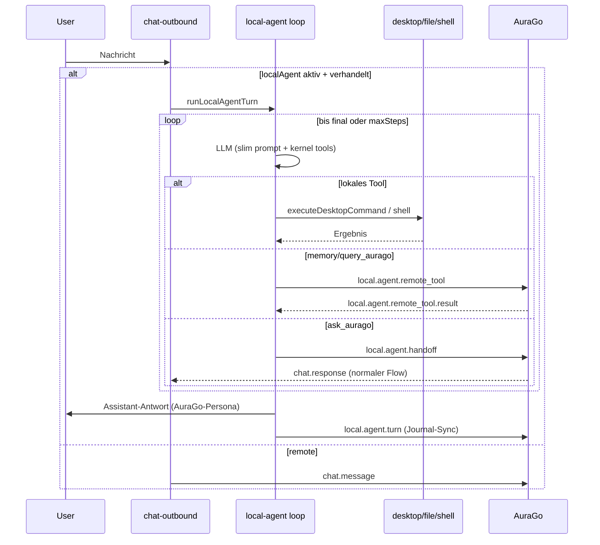

# Local Agent Mode — Design

Status: implemented (client), backend pending
Protocol: `agodesk.v1`
Client: `src/lib/services/local-agent/`

## Ziel

agodesk erhält einen optionalen lokalen Agenten. Ist er aktiviert, führt agodesk
Chat-Turns lokal aus (schlanker Prompt + Progressive Tool-Discovery) statt jede
Nachricht an AuraGo zu senden. Der lokale Agent nutzt AuraGo nur noch für:

- Gedächtnis (`memory_search`, `memory_get`)
- kurze Rückfragen (`query_aurago`)
- vollen Handoff komplexer Aufgaben (`ask_aurago`)

Antworten erscheinen als AuraGo-Persona (`persona_prompt`), damit es für den Nutzer
wirkt, als würde AuraGo arbeiten. Nach jedem lokalen Turn wird ein Journal-Eintrag
(`local.agent.turn`) an AuraGo gesendet, damit beide Systeme denselben Wissensstand
haben.

## Warum lokal

Der Server-Agent von AuraGo hat ein sehr großes Toolset und einen großen Prompt.
Für viele Aufgaben (Dateien lesen/schreiben, Shell, Screenshots, einfache Fragen)
ist ein lokaler Loop mit schlankem Prompt deutlich schneller. Nur wenn wirklich
AuraGos volles Toolset oder sein Gedächtnis nötig ist, greift der lokale Agent auf
das Backend zu.

## Architektur (Frontend Loop, Ansatz 1)

Der Loop läuft im Frontend (Svelte/TypeScript), analog zum bestehenden
`speech-tool-router`. Er ruft ein LLM über einen austauschbaren Provider auf:

- `providerSource = "aurago"`: Provider/Modell aus AuraGos Provider-Katalog
  (`config.providers`). Da der Client die API-Keys i. d. R. nicht hat, läuft der
  LLM-Aufruf über einen Backend-Proxy (`local.agent.llm`).
- `providerSource = "local"`: lokal angelegter Provider (Base-URL, API-Key, Modell),
  direkter HTTP-Aufruf im OpenAI-Chat-Completions-Format vom Client aus.

## Progressive Tool Discovery

Nur ein kleines, festes Kernel-Set ist immer im Prompt. Alle weiteren lokalen Tools
werden erst nach Bedarf aufgedeckt.

Kernel (immer):

- `list_local_tools` — Namen + Kurzbeschreibung aller aktuell freigeschalteten Tools
- `describe_tool` — vollständiges JSON-Schema eines Tools nachladen
- `memory_search`, `memory_get` — AuraGo-Gedächtnis (remote)
- `query_aurago` — kurze strukturierte Rückfrage an AuraGo (remote)
- `ask_aurago` — voller Handoff an AuraGo (remote)
- `get_client_status` — Verbindung/Session/Caps

Discoverable (abhängig von Settings + verhandelten Capabilities):

- Dateien: `file_list`, `file_read`, `file_search`, `file_write`, `file_patch`
- Shell: `shell_exec`
- Desktop (lesend): `desktop_screenshot`, `desktop_list_windows`,
  `desktop_active_window`, `desktop_host_info`, `desktop_ui_tree`

Bewusst NICHT lokal ausgeführt (nur via `ask_aurago`, weil sie den
Remote-Control-Banner-Flow brauchen): `desktop_input`, `desktop_ui_action`,
`desktop_browser_*`.

`describe_tool` schaltet ein Tool-Schema für den laufenden Turn frei; der
System-Prompt bleibt dauerhaft schlank.

## Lokale Ausführung

Discoverable Tools werden über den bestehenden Ausführungsstack ausgeführt:
Es wird ein synthetisches `desktop.command` gebaut und durch
`handleIncomingDesktopCommand` (bzw. für Shell den Shell-Flow) geschleust, mit
einem Capturing-Sender, der das entstehende `desktop.result` abfängt. Dadurch
gelten alle bestehenden Gates (Capability-Verhandlung, Datei-Roots,
Shell-Validierung, Approval-Banner) unverändert. Approval-Pausen resolven, sobald
der Nutzer im Banner freigibt.

## Remote-Tools und Handoff

- `local.agent.remote_tool` (→ AuraGo) / `local.agent.remote_tool.result` (← AuraGo):
  Request/Response mit `request_id`-Waiter (analog `providers-flow`).
- `local.agent.handoff` (→ AuraGo): behandelt den Turn wie eine normale
  User-Nachricht mit vollem Toolset; die Antwort kommt über den bestehenden
  `chat.response`/`agent.activity`-Flow. Der lokale Loop endet nach dem Handoff.

## Turn-Sync

Nach jedem lokalen Turn (auch failed/cancelled) sendet der Client
`local.agent.turn` mit: User-Text, finaler Assistant-Text, redigierte Tool-Spur
(Toolname + Outcome, keine Secrets/vollen Inhalte), Conversation/Request-IDs,
Status und Provider-Info. AuraGo schreibt das in dasselbe Journal/Knowledge wie
eigene Turns.

## Identität

Der lokale Agent hat keinen eigenen Charakter. Prompt-Lead ist `persona_prompt`
aus `persona.assets`; Antworten erscheinen unter der AuraGo-Persona.

## Fehlerbehandlung

- LLM-Fehler → sichtbare Chat-Fehlermeldung, Turn-Status `failed`.
- Remote-Tool-Timeout → einmal retry, sonst Tool-Error an das LLM.
- Approval pending → Loop wartet auf Banner-Ergebnis (Timeout → Tool-Ergebnis
  `waiting_approval`).
- Cancel (`chat.cancel`) → Loop bricht ab, Turn-Status `cancelled`.
- Offline/keine Session → nur rein lokale Tools; Memory/query/ask/handoff schlagen
  klar fehl.

## Settings

`AppSettings.localAgent`:

- `enabled: boolean`
- `providerSource: "aurago" | "local"`
- `auragoProviderId?: string`
- `localProvider?: { name, baseUrl, apiKey, model }`
- `maxSteps: number`

Ist `enabled`, wird die Capability `local.agent` in `session.start` advertised.
AuraGo muss sie in `session.accepted.advertised_capabilities` spiegeln, sonst
bleibt der lokale Agent inaktiv (Fallback: normaler Remote-Chat).
