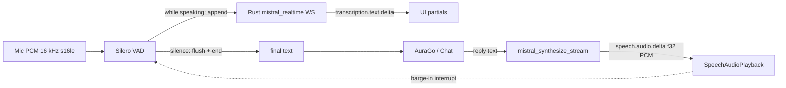

# Mistral Voice Phase 2 — Realtime ASR + Streaming TTS

Status: implemented · Provider: `mistral_voice` · Date: 2026-07-24

Extends Phase 1 (`docs/superpowers/specs/2026-07-24-mistral-voice-pipeline.md`).
Phase 1 remains the **fallback** and the path when realtime is disabled in Settings.

## Goals

1. **Lower ASR latency / live partials** via Voxtral Realtime WebSocket.
2. **Lower TTS time-to-first-audio** via streamed PCM chunks (`stream: true`).
3. **Keep Silero** as the utterance endpoint (turn boundary) and for barge-in.
4. **User-configurable**: Settings toggle to prefer realtime+streaming or stick to Phase‑1 batch/unary.

## Non-goals

- Agent-tool duplex / speech-to-speech without text (still not a Gemini/Grok-style agent).
- Browser `rt_*` client tokens (Tauri Rust can set `Authorization` on the WS).
- Voice-cloning upload UI.
- Removing Phase‑1 batch/unary paths.

## Decisions (agreed)

| Topic | Choice |
| --- | --- |
| Scope | Realtime ASR **and** Streaming TTS together |
| Turn detection | **Silero** endpoints utterances; Realtime WS receives audio during speech |
| Fallback | **Configurable** Settings toggle; when off or on failure → Phase‑1 |
| Transport | **Rust WebSocket proxy** (mirror `xai_realtime.rs`), not WebView `rt_*` |

## Architecture

When `mistralRealtimeEnabled === false` (or connect/stream fails): Phase‑1 Silero → `mistral_transcribe` → Chat → unary `mistral_synthesize`.

## Settings

Extend `SpeechSettings`:

| Field | Type | Default | Meaning |
| --- | --- | --- | --- |
| `mistralRealtimeEnabled` | `boolean` | `true` | Prefer Realtime ASR + Streaming TTS |
| `mistralAsrModel` | string | Phase‑1 default for batch; realtime uses dedicated model when enabled | Keep batch model separate |
| `mistralRealtimeAsrModel` | string | `voxtral-mini-transcribe-realtime-2602` | Realtime WS model |
| `mistralTargetStreamingDelayMs` | `number` optional | `480` | Passed via `session.update` (latency vs accuracy) |

UI (Speech → Tests, when `mistral_voice` selected):

- Toggle: „Realtime + Streaming bevorzugen“ / help text that off = Phase‑1 Batch/unary.
- Optional delay select (e.g. 240 / 480 / 960 ms) — can ship as simple number field or preset select.
- Existing voice picker unchanged.

i18n: new keys in `de`/`en` (+ locale parity).

## Realtime ASR (Rust)

New module `src-tauri/src/mistral_realtime.rs` patterned on `xai_realtime.rs`:

### Connect

- URL: `wss://api.mistral.ai/v1/audio/transcriptions/realtime?model=<model>`
- Header: `Authorization: Bearer <stored mistral key>`
- Wait for `session.created`.
- Optional: send `session.update` with `audio_format: { encoding: "pcm_s16le", sample_rate: 16000 }` and `target_streaming_delay_ms`.

### Outbound (frontend → Rust → WS)

| Client message | Purpose |
| --- | --- |
| `{ "type": "input_audio.append", "audio": "<base64 s16le>" }` | Mic chunk while Silero says speaking |
| `{ "type": "input_audio.flush" }` | Force decode remaining buffer at utterance end |
| `{ "type": "input_audio.end" }` | End of this utterance stream (then wait for `transcription.done`) |

Tauri commands (names illustrative):

- `mistral_realtime_connect({ model?, targetStreamingDelayMs? })`
- `mistral_realtime_send({ data })` — JSON string to WS
- `mistral_realtime_disconnect()`

### Inbound (WS → Tauri events → frontend)

Emit events (names illustrative):

- `mistral-realtime:state` — `connecting` / `open` / `closed`
- `mistral-realtime:message` — raw JSON string
- `mistral-realtime:error`

Relevant server event types:

| type | Handling |
| --- | --- |
| `session.created` / `session.updated` | Session ready |
| `transcription.text.delta` | Append to partial transcript UI |
| `transcription.segment` | Optional: segment boundaries (informational) |
| `transcription.language` | Optional: ignore or log |
| `transcription.done` | Final text for this utterance → `onFinalTranscript` |
| `error` | Surface error; fallback path |

### Session orchestration (`MistralVoiceSession`)

When realtime enabled:

1. `connect()` → open Rust WS + Silero endpoint + warm playback.
2. `sendAudio(chunk)` → always push to Silero; **also** `input_audio.append` while in speech (or always append and let Silero only decide when to flush — prefer append only while `inSpeech` / after speech started to save bandwidth).
3. On Silero utterance complete:
   - send `input_audio.flush` then `input_audio.end`
   - wait for `transcription.done` (timeout e.g. 8s)
   - use final text (accumulated deltas as backup)
   - if timeout/error → **fallback**: `mistral_transcribe` on the buffered utterance PCM (already available from Silero endpoint)
4. Disconnect closes WS.

Keep a per-utterance PCM buffer for the batch fallback (Silero already concatenates chunks).

## Streaming TTS (Rust + FE)

### Command

`mistral_synthesize_stream({ text, voiceId?, model? })` (async / fire-and-emit):

- POST `https://api.mistral.ai/v1/audio/speech` with JSON:
  - `model`, `input`, `voice` (required; same Phase‑1 field — **not** `voice_id`; default `en_paul_neutral` or settings)
  - `response_format: "pcm"`
  - `stream: true`
- Accept: `text/event-stream`
- Parse SSE events:
  - `speech.audio.delta` → `{ audio_data: "<base64 f32le>" }` → emit Tauri event `mistral-tts:chunk`
  - `speech.audio.done` → emit `mistral-tts:done`
  - errors → `mistral-tts:error`

Return immediately after starting the background task (or block until done while still emitting — prefer emit + resolve on `done` so callers can `await`).

Also keep unary `mistral_synthesize` for fallback and Settings probes.

### Frontend

- `mistral-tts.ts`: `speakWithMistralTts` / `synthesizeMistralSpeech`:
  - if realtime/streaming preferred → subscribe to chunk events, `enqueueBase64Float32Pcm` per chunk @ 24 kHz
  - on stream error → unary synthesize
- Cancel/barge-in: interrupt playback + abort in-flight stream task (cancellation flag in Rust state).

## ACL / registration

- Register new commands in `lib.rs` + `permissions/agodesk-commands.toml`.
- Manage `MistralRealtimeState` (+ optional stream-cancel state) in Tauri `manage()`.

## Failure matrix

| Failure | Behavior |
| --- | --- |
| No API key | Existing error (unchanged) |
| Realtime connect fail | Toast/status; if toggle on → fall back to batch for that session/utterance |
| `transcription.done` timeout | Batch `mistral_transcribe` on buffered PCM |
| Streaming TTS fail mid-way | Interrupt partial audio; retry unary once; else surface error |
| Toggle off | Never open Realtime WS; unary TTS only |

## Tests

- Unit: settings normalize for new fields; provider still not `speechProviderIsCloudRealtime`.
- Unit/mock: parse SSE `speech.audio.delta` / Realtime event type dispatch (pure helpers).
- Factory still returns `MistralVoiceSession`.
- Manual: with stored key — Partials appear during speech; first audio before full TTS completes; toggle off restores Phase‑1.

## Docs

- Update Phase‑1 spec status line to “Phase 1 + Phase 2 design”.
- This file is the Phase‑2 design source of truth until implementation plan lands.

## Open implementation notes (non-blocking)

1. Exact SSE event field naming (`event:` vs JSON `type`) — confirm against live API during impl (Phase‑1 taught us `voice` ≠ docs’ `voice_id`).
2. Whether to keep one long-lived Realtime WS for the whole mic session (preferred) vs one WS per utterance (simpler, higher connect cost).
3. `reqwest` streaming SSE may need `stream` feature or `eventsource`-style parsing in a tokio task.
