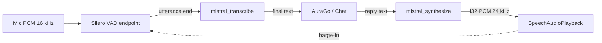

# Mistral Voice Pipeline (Silero + Voxtral ASR/TTS)

Status: Phase 1 shipped · Phase 2 implemented · Provider id: `mistral_voice`

## Overview

`mistral_voice` is the fifth speech provider next to `gemini_live`, `grok_voice`,
`hybrid` and `offline`. Unlike Gemini Live / Grok Voice it is **not** an
audio-realtime agent duplex: Voxtral is STT + TTS only. The pipeline therefore
mirrors the local utterance loop (`LocalSpeechSession`), but proxies ASR and TTS
through the Mistral cloud instead of the sidecar:

## Mistral Voxtral API (api.mistral.ai)

| Role | Model (default) | Endpoint |
| --- | --- | --- |
| ASR (batch) | `voxtral-mini-latest` | `POST /v1/audio/transcriptions` (multipart `file` + `model`) |
| TTS | `voxtral-mini-tts-2603` | `POST /v1/audio/speech` (`input`, `voice_id`, `response_format`) |

- **TTS output:** 24 kHz mono. `response_format: "pcm"` returns raw **float32 LE**
  PCM (lowest time-to-first-audio ≈ 0.8 s vs. ≈ 1.5–2 s for mp3).
- **ASR input:** OpenAI-compatible multipart. Mic PCM (16-bit mono @ 16 kHz) is
  wrapped in a minimal WAV container in Rust before upload.
- 9 languages incl. DE/EN. Optional `language` hint (ISO primary code).

## Rust proxy (`src-tauri/src/commands.rs`)

Key is kept server-side (OS keyring + protected fallback file), mirroring the
Gemini/xAI pattern. Commands (registered in `lib.rs`, allowed in
`permissions/agodesk-commands.toml`):

- `store_mistral_api_key` / `get_mistral_api_key` / `delete_mistral_api_key` /
  `has_mistral_api_key`
- `test_mistral_api_key({ network })` — local check by default; `GET /v1/models`
  when `network: true`.
- `mistral_transcribe({ pcmBase64, sampleRate, model?, language? }) -> { text }`
- `mistral_synthesize({ text, voiceId?, model? }) -> { audioBase64, sampleRate, encoding }`
  (`encoding: "f32le"`, `sampleRate: 24000`).

`reqwest` gains the `multipart` feature for the transcription upload.

## Frontend

- Types/helpers: `protocol.ts` (`isMistralSpeechProvider`,
  `speechProviderRequiresMistralApiKey`, defaults). `mistral_voice` is
  intentionally **excluded** from `speechProviderIsCloudRealtime` (no agent-mode
  tool duplex).
- Credentials: `mistral-credentials.ts`.
- ASR: `mistral-asr.ts` → `invoke("mistral_transcribe")`.
- TTS: `mistral-tts.ts` → `invoke("mistral_synthesize")` → float32 PCM played via
  `SpeechAudioPlayback.enqueueBase64Float32Pcm`.
- Session: `mistral-voice-session.ts` — Silero endpointing (energy fallback),
  reuses `LocalSpeechUtteranceEndpoint` (injectable VAD), then transcribe → final
  transcript → TTS. Selected in `speech-session-factory.ts`.
- Flow: `speech-flow.ts` checks the Mistral key before connecting.
- Chat-unary TTS (mic off): wired in `chat-ws-inbound.ts`, `chat-outbound.ts`
  and `local-speech-tts.ts` (after Grok, before local sidecar). Barge-in interrupt
  added to `interruptLocalSpeechPlayback`.
- Settings UI: provider radio, API-key card + local/online test, Voxtral voice-id
  field (Speech → "Tests" subsection). i18n keys in `de`/`en` (other locales fall
  back via `de → en → locale`).

## Not in scope (Phase 1)

- Voxtral Realtime WebSocket ASR (partials / lower latency) — Phase 2.
- Streaming TTS chunk events.
- Voice-cloning upload UI (`/v1/audio/voices`) — only a `voice_id` text field.
- Local open-weights hosting of Voxtral.
