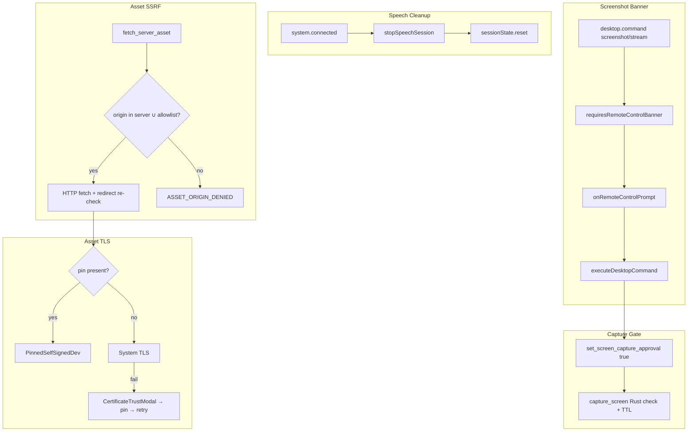

# Audit Top-5 Hardening — Pragmatische Security- & Reliability-Fixes

Status: approved design · Date: 2026-08-01 · Basis: App-Audit (Sicherheit / Fehler)

Umsetzt die priorisierten High-Findings aus dem Vollaudit mit **Ansatz „Thin Defense Layer“** (kein volles Session-Token-System).

## Goals

1. **Q1** — Speech-Session bei WS-Reconnect (`system.connected`) zuverlässig stoppen.
2. **S2** — Screenshot/Stream zeigt Remote-Control-Banner (Consent sichtbar).
3. **S3** — Asset-Fetch gegen SSRF härten (Server-Origin + Allowlist).
4. **S4** — Asset-TLS Homelab nicht mehr silent insecure; Confirm→Pin über bestehenden Dialog.
5. **S1** — Privilegierte IPC-Hotspots pragmatisch härten (Capture-Approval + TTL, URL-Schema-Allowlist).

## Non-goals

- Volles Rust-Session-/Capability-Token für alle ~100 Tauri-Commands.
- Pairing-Token Keyring-Migration / Windows DPAPI für Secret-Fallbacks.
- CSP-Nonce-Umstellung.
- Mistral Realtime Reconnect, Gemini parallele Tool-Call-Queue (andere High-Findings).
- Extra Approval-Dialog für Screenshots (nur Banner).

## Decisions (agreed)

| Topic | Choice |
| --- | --- |
| Scope S1 | **A Pragmatisch** — gezielte Hotspots, kein generisches Session-Gate |
| Screenshot Consent | **A Banner only** — Banner sichtbar, Capture sofort; kein Approval-Queue |
| TLS Homelab | **B Einmalige UI-Bestätigung** — bestehender Cert-Trust-Dialog; Asset-TLS an WS angleichen |
| Asset Origin | **B Same-origin + Allowlist** — `assetFetchAllowedOrigins` |
| Architektur | **Thin Defense Layer** an bestehenden Hotspots |

## Architecture

## Behavior by fix

### Q1 — Speech on reconnect

- In `chat-ws-inbound.ts`, on `system.connected`, call `await stopSpeechSession().catch(() => {})` **before** `sessionState.reset()`.
- Mirrors `chat-ws-connect.ts` manual connect path.

### S2 — Screenshot / stream banner

- Extend `requiresRemoteControlBanner` so it returns true for:
  - `desktop_screenshot`
  - `desktop_stream_start`
  - `desktop_stream_stop`
- Keep `requiresLocalDesktopApproval` **false** for these (no pending-input queue).
- Existing `desktop-flow.ts` already calls `onRemoteControlPrompt` when banner required and remote control inactive; execution continues immediately.

### S3 — Asset origin bind + allowlist

- New setting: `assetFetchAllowedOrigins: string[]` (default `[]`) on `AppSettings`.
- Normalize entries to HTTP(S) origins (scheme + host + optional port).
- `fetch_server_asset_impl`:
  - Resolve server origin from `server_url`.
  - Allow fetch if asset origin equals server origin **or** is in allowlist.
  - On each redirect hop, re-validate the new URL against the same set.
  - Reject with a clear error (e.g. `ASSET_ORIGIN_DENIED`) otherwise.
- Pass allowlist from TS invoke path (settings) into the Rust command (or read from a small store if already patterned that way — prefer explicit argument for testability).
- Settings UI: short multi-line / chip list under Device or Advanced for allowed asset origins.

### S4 — Asset TLS align with WS

- Change `determine_asset_tls_mode`:
  - Homelab/LAN **without** pin → `TlsMode::System` (not `InsecureLoopbackDev`).
  - With pin → `PinnedSelfSignedDev`.
- Loopback + explicit insecure remains WS concern via `determine_tls_mode` / `insecure_loopback`; do not expand insecure asset defaults.
- User trust path: existing `CertificateTrustModal` → `saveTrustedCertificateForServer` → reconnect; subsequent asset fetches pick up pin.

### S1 — IPC hotspots

1. **Screen capture approval** (`desktop/permission.rs` + commands):
   - `set_screen_capture_approved(bool)` / `is_screen_capture_approved()`.
   - `capture_screen` rejects unless approved.
   - When set `true`, record `Instant`; after **60 seconds** treat as not approved.
   - `desktop.ts`: before screenshot / stream start, `set_screen_capture_approval(true)`; clear after successful capture / stream stop when practical (TTL is safety net).
   - Error mapping: always use new code `DESKTOP_CAPTURE_NOT_APPROVED` in the desktop command result (extend `DesktopErrorCode` in `protocol.ts`).

2. **Input approval TTL**:
   - Same 60s auto-expire for `set_input_approved(true)`.
   - `set_input_approved(false)` clears immediately.
   - `reset_desktop_session` clears both input and capture approval.

3. **`open_external_url`**:
   - Allow only schemes: `https`, `http`, `mailto`.
   - Reject `file:`, `javascript:`, `data:`, custom handlers, etc.

## Settings

| Field | Type | Default | Meaning |
| --- | --- | --- | --- |
| `assetFetchAllowedOrigins` | `string[]` | `[]` | Extra HTTP(S) origins allowed for `fetch_server_asset` beyond the connected server origin |

## Error handling

| Case | Result |
| --- | --- |
| Capture without approval | Rust `Err`; desktop command failure with `DESKTOP_CAPTURE_NOT_APPROVED` |
| Asset origin denied | Rust `Err` with `ASSET_ORIGIN_DENIED` (or equivalent message); media UI shows existing failure path |
| Asset TLS fail without pin | System TLS error; user uses cert trust modal on WS, then retry |
| External URL bad scheme | Rust `Err`; no `open::that` |

## Testing (TDD)

- `protocol.test.ts`: banner true for screenshot/stream; local approval still false.
- Rust `permission` tests: TTL expire for input + capture; reset clears both.
- Rust `asset_fetch` tests: same-origin ok; foreign host denied; allowlist ok; redirect to foreign denied.
- Rust `tls` tests: LAN/homelab without pin → `System`.
- Rust `open_external_url` / helper tests: allow https/http/mailto; deny file/javascript.
- TS: inbound reconnect calls `stopSpeechSession` (unit test with stubbed deps if structure allows; otherwise extract a tiny helper `onSystemConnectedCleanup` and test that).

## Success criteria

- [ ] Reconnect stops active speech session.
- [ ] Screenshot/stream shows remote-control banner.
- [ ] Direct `capture_screen` invoke without prior approval fails.
- [ ] Input approval auto-expires within 60s.
- [ ] Asset fetch to unrelated host fails; allowlist entry succeeds.
- [ ] Homelab asset TLS without pin uses System mode.
- [ ] `open_external_url("file:///...")` fails.
- [ ] Existing check / cargo check / relevant unit tests green.

## Files (expected touch list)

| Area | Files |
| --- | --- |
| Speech cleanup | `src/lib/services/chat-ws-inbound.ts` (+ small helper/test if extracted) |
| Banner | `src/lib/types/protocol.ts`, `protocol.test.ts` |
| Capture/input TTL | `src-tauri/src/desktop/permission.rs`, `commands.rs`, `desktop.ts` |
| Asset SSRF | `src-tauri/src/ws/asset_fetch.rs`, `transport.rs` (command args), TS fetch wrapper, `protocol.ts` settings, Settings UI |
| Asset TLS | `src-tauri/src/ws/tls.rs` (+ tests) |
| External URL | `src-tauri/src/commands.rs` (+ tests or helper module) |
| i18n | keys for new settings label/help (de + en minimum; other locales may fall back) |
