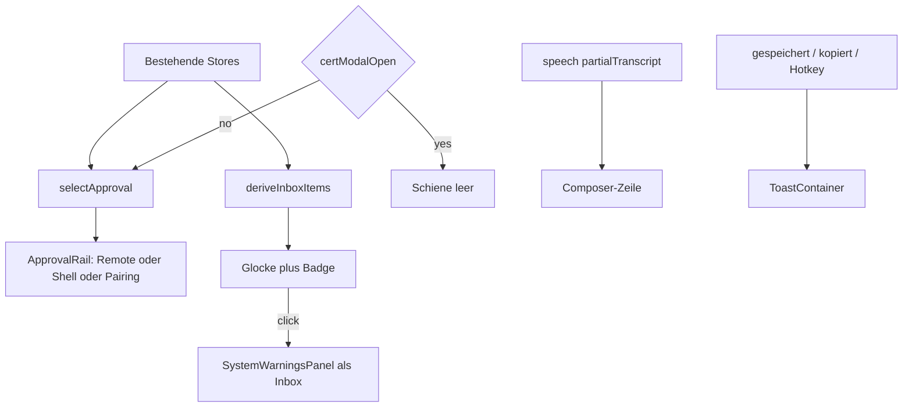

# Chrome-Diät — Inbox plus eine Approval-Schiene

Status: approved · implemented · Date: 2026-09-08

Der Chat ist die Hauptfläche. Statusleiste, eine Approval-Schiene und eine Hinweis-Inbox ersetzen den heutigen Banner-Stapel.

## Goals

1. Im Normalfall sind nur Statusleiste, Chat und Composer sichtbar.
2. Kritische Freigaben (Remote, Shell, Pairing) teilen sich genau eine Schiene. Es ist immer nur eine sichtbar.
3. Unkritische Hinweise (Update, Systemwarnungen, Speech-Fehler, Plan, Activity) landen in der bestehenden Glocke, nicht als Chat-Banner.
4. Dieselbe Lage hat nur eine Stimme: keine Kombination aus Banner plus Toast plus Composer-Hint.
5. Update-, Remote- und Shell-Banner sind keine `aria-modal`-Dialoge mehr.

## Non-goals

- Settings-IA (Overlay, gruppierte Nav, Feld-Suche, Autosave).
- Theme-Optik (Aurora/Chaos/Cyber/Papyrus, Default-Typo).
- Onboarding-Inhalt und Schrittfolge.
- Vault-Secret-, Integration-Embed- und OAuth-Modals.
- Neue Persistenz für Inbox-Items.
- Command Palette oder Skip-to-Content (Audit M6, eigener Track).
- Nachricht-Aktionen Copy/Retry (Audit M8).
- Composer-Icon-Menü (Audit M2), außer Speech-Teilsttranskript wandert an den Composer.

## Decisions (agreed)

| Topic | Choice |
| --- | --- |
| Architektur | **A** Inbox plus eine Approval-Schiene |
| TLS | Bleibt `CertificateTrustModal`. Schiene ist leer, solange das Modal offen ist. |
| Plan / Activity | Inbox-Zeile, kein schwebendes Banner. Kein Badge für laufende Items. |
| Speech-Teilsttranskript | Eine Zeile am Composer, kein Chat-Banner. |
| Speech-Fehler | Inbox, nicht Banner und nicht Toast. |
| Status-Pille | Öffnet nicht Settings. Getrennt/Fehler: Reconnect. Pairing nötig: Fokus auf die Schiene. |
| Update | Inbox-Eintrag, kein Focus-Trap, kein `aria-modal`. |
| Toasts | Nur ephemere Bestätigungen. |
| Header-Panels | Maximal eines offen: History, Integrationen oder Inbox. |
| Pairing-Surfaces | Nur die Schiene. Empty-State-Button erhöht `pairingFocusRequest`. |
| Badge | Nur ungelesene Items: Systemwarnungen + Update + Speech-Fehler. |
| `bannerStackCompact` | Entfällt. |

## Architecture

```
+--------------------------------------------------+
| Statusleiste  [Status] [Inbox*] [..] [Settings]  |
+--------------------------------------------------+
| Approval-Schiene  (leer oder genau eine Freigabe)|
+--------------------------------------------------+
| Chat                                             |
+--------------------------------------------------+
| [Speech-Teilsttranskript, nur wenn hörend]       |
| Composer                                         |
+--------------------------------------------------+
```



### Schicht-Regeln

| Schicht | Sichtbar | Inhalt |
| --- | --- | --- |
| Statusleiste | immer | Verbindung, Inbox-Badge, History, Integrationen, Voice, Theme, Settings, Window-Controls |
| Approval-Schiene | nur bei Freigabe und geschlossenem TLS-Modal | genau eine: Remote, Shell oder Pairing |
| Inbox-Panel | nur nach Klick auf die Glocke | Updates, Systemwarnungen, Speech-Fehler, Plan, Activity |
| Echte Modals | bei Bedarf | TLS, Vault, Onboarding, Embed, OAuth |
| Toasts | kurz | gespeichert, kopiert, Hotkey-Konflikt, Update-Check „aktuell“ |

## Components

### `selectApproval(state)` (neu, rein)

Priorität, erste passende gewinnt:

1. `certModalOpen` → `null`
2. Desktop an und Remote pending oder active → `"remote"`
3. Shell pending mit Request → `"shell"`
4. Session `awaiting_pairing` oder Session `error` mit Pairing-Bedarf → `"pairing"`
5. sonst → `null`

Keine UI-Queue. Die nächste Freigabe erscheint, sobald die aktuelle weg ist. Remote active bleibt `"remote"`, bis Stop.

Pairing-Bedarf bei Session `error` gilt, wenn der Empty-State heute schon „Gerät koppeln“ zeigt: `sessionStatus === "awaiting_pairing" || sessionStatus === "error"`.

### `ApprovalRail` (neu, dünn)

- Sitzt in `ChatView` **außerhalb** des Settings/Chat-Wechsels, dort wo Remote- und Shell-Banner heute schon leben. Freigaben bleiben sichtbar, wenn Settings offen sind.
- Im Chat-Zweig steht die Schiene optisch unter der Statusleiste, über `MessageList`.
- Rendert genau eines: `RemoteControlBanner`, `ShellApprovalBanner` oder `PairingBanner`.
- Ist eine `region` mit `aria-live="assertive"`.
- `bannerStackCompact` und der Pairing-Info-Banner (`chatView.pairing.authenticating`) entfallen. Session `pairing` bleibt Status-Pille plus Composer-Hint.

### Banner-Markup

`RemoteControlBanner`, `ShellApprovalBanner` und `UpdateBanner` (letzterer nur noch im Inbox-Panel):

- kein `role="dialog"`
- kein `aria-modal="true"`
- kein `use:focusTrap`

Fokus ohne App-Sperre:

- Pairing: bestehendes `pairingFocusRequest` fokussiert das Token-Feld und scrollt es sichtbar
- Remote/Shell: Fokus auf den primären Button, Chat bleibt tabbbar
- TLS-Modal: unverändert Dialog plus Focus-Trap

### Inbox (bestehende Glocke + `SystemWarningsPanel`)

`deriveInboxItems()` baut eine Liste aus vorhandenen Stores. Kein neuer Persist-Store. Internes Rename `warningsOpen` → `inboxOpen` ist optional und kein Muss für den ersten Schnitt.

| Quelle | Item | Zählt ins Badge | Aktion |
| --- | --- | --- | --- |
| `chatMediaState.systemWarnings` | Warnung | ja, wenn unacknowledged | Acknowledge wie heute |
| `updateState` `available` oder `downloading` | Update | ja, bis dismiss oder install | `UpdateBanner` **im Panel wiederverwenden** (kein zweites Markup); `dismissUpdate` / `installUpdate` |
| `speechState.errorMessage` oder `vadError` | Speech-Fehler | ja, bis Speech neu startet oder der Nutzer den Eintrag schließt | `errorMessage` und `vadError` leeren |
| `chatPlanState` nicht completed/cancelled | Plan, eine Zeile | nein | Expand rendert den bestehenden Plan-Inhalt im Panel, nicht als schwebendes Banner |
| `activityTimelineState` mit nicht-terminaler Activity | Activity, eine Zeile | nein | Expand rendert den bestehenden Timeline-Inhalt im Panel; Shell-Stop wie heute |

Badge an der Glocke = Anzahl ungelesener Items (Warnungen + Update + Speech-Fehler).

`SpeechBanner` als Chat-Banner entfällt. `ChatPlanFloatingPanel` und `ActivityTimelinePanel` werden nicht mehr unter der Statusleiste eingehängt. Ihr Inhalt erscheint nur noch als Inbox-Zeile; Expand bettet dieselbe Komponenten-Logik im Panel ein. Update während offener Settings ist unsichtbar, bis der Chat zurückkehrt. Settings „Nach Updates suchen“ bleibt der bewusste Weg dort.

Artifact-Inspector bleibt unverändert und nur, wenn der Nutzer ein Artifact öffnet.

Header-Panels: History, Integrationen, Inbox. Weiterhin maximal eines offen. Inbox-Panel darf offen bleiben, wenn eine Freigabe in der Schiene erscheint.

### Statusleiste

- Status-Pille `onclick` öffnet nicht `openSettings()`.
- `connectionStatus === "disconnected" || "error"` → bestehendes `onReconnect`.
- Pairing nötig → `pairingFocusRequest += 1`.
- Sonst keine Navigation. Zahnrad bleibt Settings.
- `warningsUnacknowledged` Prop wird zur Inbox-Badge-Zahl.

### Composer

- Teilsttranskript: eine Zeile über dem Textfeld in `InputBox`, gespeist aus `speechState.partialTranscript`.
- Speech-Fehler nicht mehr am Composer-Banner.
- Drag-and-Drop bleibt lokal.
- Composer-Hint für Verbindung/Pairing bleibt der eine blockierende Satz. Kein paralleler Toast.

### Empty State

`CompanionPresenceCard`-Button „Gerät koppeln“ erhöht nur `pairingFocusRequest`. Kein zweites Formular, kein Sprung in Settings Device.

## Error and edge cases

| Lage | Verhalten |
| --- | --- |
| Zwei Approvals gleichzeitig | Nur die höhere Priorität in der Schiene. Die andere wartet im bestehenden State. |
| Speech-Fehler während Pairing | Fehler in die Inbox, Pairing bleibt in der Schiene. |
| Update während Remote | Update nur Badge, Schiene bleibt Remote. |
| TLS-Modal offen | Schiene leer. Inbox und Chat bleiben bedienbar hinter dem Modal. |
| Trennung mitten in der Schiene | Schiene leer, Status-Pille getrennt, ein Composer-Hint. |
| Session `pairing` (authentifiziert) | Keine Schiene, kein Info-Banner. Status-Pille plus Hint. |
| Inbox offen plus neue Freigabe | Schiene erscheint, Panel bleibt offen. |
| Reduce-Motion | Keine neuen Daueranimationen an Schiene oder Inbox. Bestehende Kill-Switch-Regeln gelten. |
| Toasts für Verbindung/Pairing/Remote/Shell/Speech | Entfernen oder nicht neu hinzufügen. |

## Testing

Unit, keine Pixel-Tests:

1. `selectApproval`: jede Prioritätsstufe, TLS erzwingt `null`, Remote active schlägt Shell, leerer State ist `null`.
2. `deriveInboxItems` / Badge: laufender Plan zählt nicht; unacknowledged Warning, available Update und Speech-Fehler zählen.
3. Update und Speech-Fehler erzeugen kein Chat-Banner mehr (`isUpdateBannerVisible` wird nicht mehr für ein Banner in `ChatView` genutzt, oder die Funktion bleibt nur für den Inbox-Eintrag).
4. Empty-State-CTA und Status-Pille bei Pairing erhöhen `pairingFocusRequest`, öffnen Settings nicht.
5. Remote/Shell-Markup ohne `aria-modal` und ohne Focus-Trap.
6. Bestehende Tests für Shell-Approval, Remote-Consent, Pairing-Submit, Update-Dismiss bleiben grün.

## Files (expected)

| Datei | Änderung |
| --- | --- |
| `src/lib/services/chrome-placement.ts` (neu) | `selectApproval`, `deriveInboxItems`, Badge-Zähler |
| `src/lib/services/chrome-placement.test.ts` (neu) | Priorität, Badge, TLS-Leer |
| `src/lib/components/ApprovalRail.svelte` (neu) | Wählt und rendert genau ein Banner |
| `src/lib/components/ChatView.svelte` | Schiene einhängen, Speech/Plan/Activity/Update-Banner entfernen, Status-Pille verdrahten |
| `src/lib/components/StatusBar.svelte` | Pille: Reconnect oder Pairing-Fokus, nicht Settings |
| `src/lib/components/SystemWarningsPanel.svelte` | Inbox-Items rendern (Update, Speech, Plan, Activity) |
| `src/lib/components/InputBox.svelte` | Teilsttranskript-Zeile |
| `src/lib/components/RemoteControlBanner.svelte` | Dialog-Rollen und Focus-Trap entfernen |
| `src/lib/components/ShellApprovalBanner.svelte` | wie Remote |
| `src/lib/components/UpdateBanner.svelte` | Dialog-Rollen und Focus-Trap entfernen; im Inbox-Panel wiederverwendet oder Inhalt dorthin gezogen |
| `src/lib/components/SpeechBanner.svelte` | aus `ChatView` entfernt; Datei darf vorerst liegen bleiben |
| `src/lib/components/ChatPlanFloatingPanel.svelte` | aus `ChatView` entfernt |
| `src/lib/components/ActivityTimelinePanel.svelte` | aus `ChatView` entfernt; Expand-Inhalt in der Inbox |

i18n: bestehende Keys wiederverwenden. Neue Keys nur für Inbox-Gruppenlabels (Update, Speech, Plan, Activity), falls die Panel-Überschriften nicht reichen.

## Out of scope follow-ups

- Settings-Track (Audit H2, M3, M4, M10).
- Default-Look (Audit H3, M12).
- Command Palette / Skip-Link (M6).
- Composer-Plus-Menü (M2).
- Message-Hover-Aktionen (M8).
